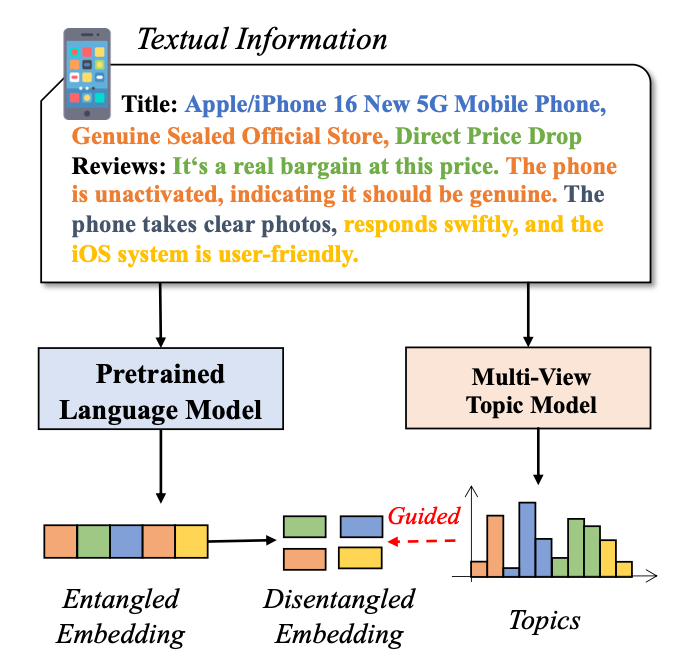
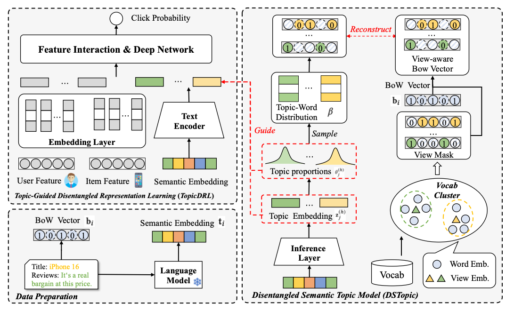
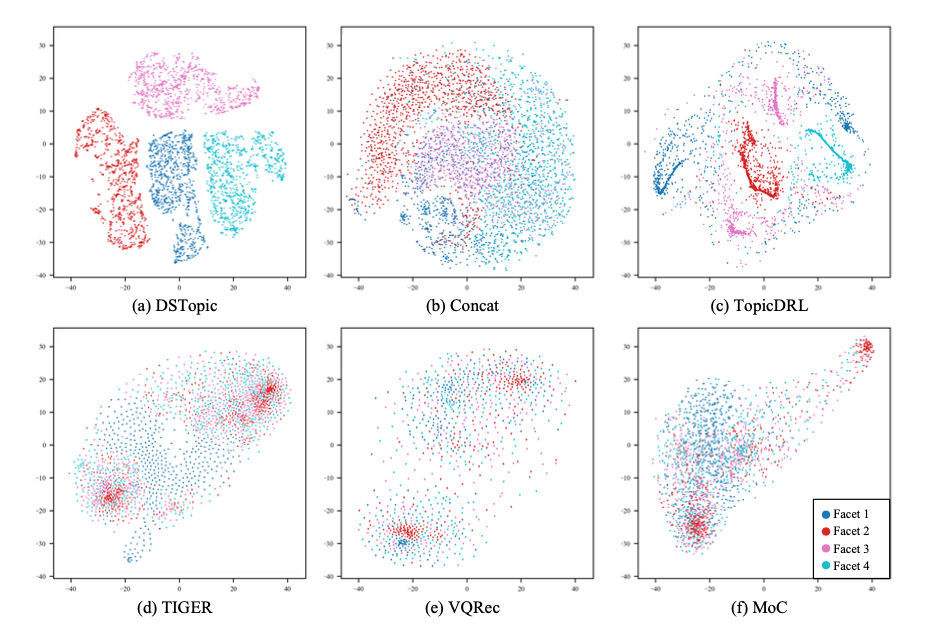
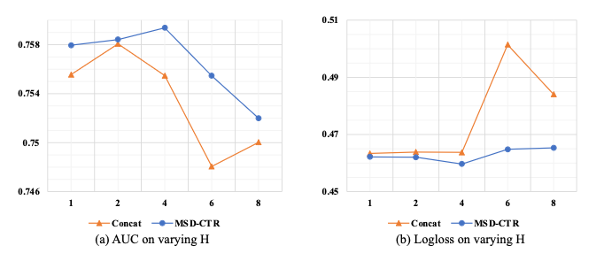

## 🧠 Introduction

Click-through rate (CTR) prediction is vital in online advertising and recommendation systems. With Pretrained Language Models (PLMs), text-rich user/item features are now integrated into CTR models to enhance semantic understanding. However, most models aggregate all textual data into a single embedding, leading to **entangled representations** that weaken fine-grained feature interactions.

To overcome this, we propose a new framework: **MSD-CTR (Multi-faceted Semantic Disentanglement for CTR prediction)**.

---

## 🛠️ The Proposed Framework: MSD-CTR

MSD-CTR includes two key components:

### 1. Disentangled Semantic Topic Model (**DSTopic**)
- Extracts **multi-faceted knowledge** from item-related textual descriptions.
- Employs a **disentangled multi-view topic model** based on Variational Autoencoder (VAE).
- Incorporates a **vocabulary clustering module** to allocate words to different semantic views.

### 2. Topic-Guided Disentangled Representation Learning (**TopicDRL**)
- Learns disentangled semantic embeddings guided by topic structure.
- Uses two losses:
  - **Individual-level alignment loss**
  - **Intra-view contrastive loss**

---

## 📊 Experimental Results

We evaluate MSD-CTR on four Amazon datasets:

- **Arts & Crafts**
- **Grocery**
- **Office Products**
- **Garden**

### Metrics:
- **AUC**
- **LogLoss**

MSD-CTR consistently outperforms strong baselines like DCNv2, DeepFM, CTRL, TIGER, and VQRec.

---

## 🔍 Qualitative Insights

Learned topics are semantically disentangled across views:

- View 0: Healthy snacks
- View 1: Cooking essentials
- View 2: Dietary preferences
- View 3: Customer feedback

We also use t-SNE to visualize learned embeddings:

---

## 🔬 Ablation Studies

We analyze performance drops when removing:

- Topic embeddings
- Alignment losses

MSD-CTR consistently proves its advantage through both metrics and visualization.

---

## 📚 Related Work

This work builds on:

- CTR prediction using text/graph/vision
- VAE-based neural topic modeling
- Disentangled representation learning in recommendation

---

## 🧾 Conclusion

MSD-CTR shows that disentangling semantic representations leads to significantly better CTR prediction. With its topic-guided learning pipeline and multi-faceted view modeling, it provides a generalizable framework for other recommendation tasks.
