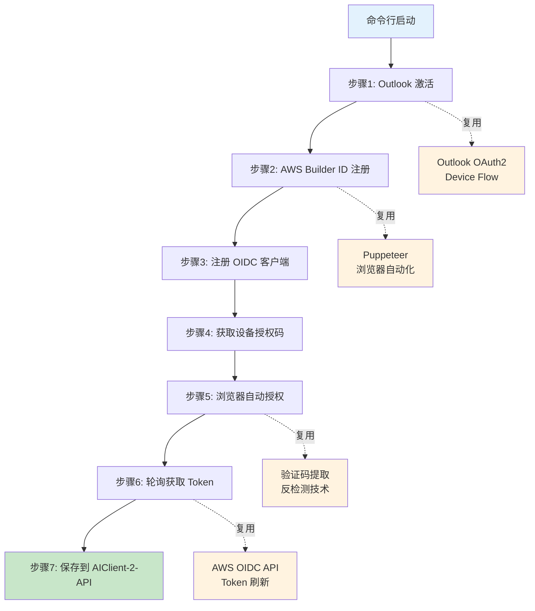

## 目录

1. [项目概述](#项目概述)
2. [Outlook OAuth2 登录验证逻辑](#outlook-oauth2-登录验证逻辑)
3. [AWS Builder ID 登录验证逻辑](#aws-builder-id-登录验证逻辑)
4. [AIClient-2-API 对 Kiro 的处理](#aiclient-2-api-对-kiro-的处理)
5. [完整自动化脚本实现](#完整自动化脚本实现)
6. [技术要点与最佳实践](#技术要点与最佳实践)
7. [常见问题与解决方案](#常见问题与解决方案)

---

## 项目概述

本项目实现了 AWS Builder ID 的完全自动化注册流程，包括：

- Outlook 邮箱的离线验证码获取（通过 Microsoft Graph API）
- AWS Builder ID 注册流程的浏览器自动化
- 与 AIClient-2-API 的集成，实现 Claude Kiro 模型的自动化调用

**技术栈**：

- Electron + TypeScript（桌面应用）
- Puppeteer（浏览器自动化）
- Microsoft Graph API（邮箱验证码获取）
- Node.js + Express（AIClient-2-API 后端）

### 系统架构设计

#### 整体架构设计

系统由四个核心模块组成，通过标准接口实现端到端的自动化：

1.  **Kiro-auto-register (Electron App)**：
    - **UI层**：提供用户交互界面，展示注册进度和状态。
    - **业务逻辑层**：协调浏览器自动化模块与邮箱验证模块，实现自动注册流转。
    - **技术支撑**：集成 Puppeteer 进行页面控制，调用 Microsoft Graph API 异步获取邮件。
2.  **Microsoft 365 邮箱系统**：
    - 通过 **OAuth 2.0 Device Flow** 进行安全授权。
    - 提供 **Graph API** 接口，允许程序在不登录网页版邮箱的情况下，直接读取验证码。
3.  **AWS Services**：
    - **注册页面**：接收浏览器自动化指令，处理账号创建。
    - **邮件服务**：触发验证流程并向 Outlook 发送 6 位数字验证码。
4.  **AIClient-2-API (后端集成)**：
    - **凭证池管理**：存储并维护注册成功后的 Builder ID 和 Refresh Token。
    - **服务转发**：将 OpenAI 格式的请求转化为 Amazon Q 或 CodeWhisperer 的 API 调用。

#### OAuth 2.0 Device Flow 流程

该流程解决了自动化脚本登录 Outlook 时可能遇到的人机验证（CAPTCHA）问题：

1.  **请求设备码**：App 向 Microsoft 授权端点请求设备码。
2.  **用户授权**：App 获取 `user_code` 和验证链接，用户在浏览器中一次性授权。
3.  **令牌获取**：App 后台轮询，成功后获取 `access_token`（1小时有效）和 `refresh_token`（长期有效）。
4.  **邮件提取**：后续所有验证码获取均通过 `access_token` 调用 Graph API 完成，无需再次登录邮箱。

#### AWS Builder ID 注册操作流程

1.  **环境初始化**：App 启动 Puppeteer 浏览器并配置指纹伪装，访问 AWS 注册页。
2.  **提交邮箱**：自动化输入注册邮箱并点击继续。
3.  **异步获取验证码**：
    - AWS 发送邮件至 Outlook。
    - App 启动轮询，通过 Graph API 获取最新邮件列表。
    - 正则匹配提取 6 位数字验证码。
4.  **验证与完成**：
    - Puppeteer 将验证码填入 AWS 页面。
    - 自动化填写姓名等 Profile 信息。
5.  **结果持久化**：注册成功后，App 抓取返回的 Builder ID，并与 Refresh Token 一起保存到本地 JSON 或数据库。

#### AIClient-2-API Kiro Provider 架构

- **请求处理链**：OpenAI 格式请求 -> 请求处理器 -> 模型重定向插件（如 Opus 转 Sonnet） -> Kiro 提供商。
- **凭证管理**：凭证池管理器从库中挑选健康凭证，检查本地内存缓存中的 Token 是否有效。如果失效，则利用 `refresh_token` 调用 AWS 认证端点。
- **API 调用**：根据负载和优先级，选择 Amazon Q API 或 CodeWhisperer API 进行流式输出转换。
- **异常闭环**：捕获 401/403 错误（标记凭证不健康）、429 错误（触发池轮换）、5xx 错误（执行指数退避重试）。

#### 凭证池轮换与健康维护策略

为了保证高可用性和突破单一账号的速率限制，系统采用以下逻辑：

1.  **分级状态检查**：凭证分为“健康”、“不健康”、“未知”三种状态。系统优先从“健康”队列中按顺序（Round Robin）提取凭证。
2.  **自动化刷新**：
    - 请求前检查：如果缓存 Token 剩余有效期小于 60 秒，自动触发刷新。
    - 刷新失败处理：若刷新失败，立即将该凭证标记为“不健康”，并切换至下一个。
3.  **实时反馈机制**：
    - **401/403**：意味着权限失效或账号被风控，标记为不健康，等待人工检查。
    - **429**：意味着触发了 AWS 的速率限制，暂时切换凭证，并在一段时间后重试该凭证。

#### 系统数据项总结

| 类别         | 关键数据项                                                   | 作用                      |
| :----------- | :----------------------------------------------------------- | :------------------------ |
| **输入数据** | 邮箱列表、初始密码、Microsoft App Client ID                  | 初始配置                  |
| **认证数据** | `access_token` (短期), `refresh_token` (长期), `device_code` | 维持邮箱和 AWS 的访问权限 |
| **注册数据** | `sessionId`, `verificationCode`                              | 注册流程中的中间态数据    |
| **产出数据** | `Builder ID`, `Profile ARN`, `New Refresh Token`             | 最终可用于 API 调用凭证   |
| **监控数据** | 请求响应时间、Token 消耗量、错误状态码                       | 性能分析与健康度统计      |

---

## Outlook OAuth2 登录验证逻辑

### 认证流程

Outlook 使用 **OAuth 2.0 Device Authorization Grant** 流程，这是一种专为无浏览器或输入受限设备设计的授权方式。

#### 1. 获取设备码（Device Code）

**请求端点**：

```
POST https://login.microsoftonline.com/consumers/oauth2/v2.0/devicecode
```

**请求参数**：

- `client_id`: 应用程序的客户端 ID（从 Azure AD 注册获取）
- `scope`: 请求的权限范围，例如：
- `https://graph.microsoft.com/Mail.Read` - 读取邮件
- `https://graph.microsoft.com/Mail.ReadWrite` - 读写邮件
- `offline_access` - 获取刷新令牌（refresh_token）

**返回参数**：

```json
{
  "device_code": "BAQABAAEAAAAm-06blBE1TpVMil8KPQ41...",
  "user_code": "ABCD1234",
  "verification_uri": "https://microsoft.com/devicelogin",
  "expires_in": 900,
  "interval": 5,
  "message": "To sign in, use a web browser to open the page..."
}
```

**参数说明**：

- `device_code`: 设备码，用于后续轮询获取 access_token（**不展示给用户**）
- `user_code`: 用户验证码，需要用户在浏览器中输入（**展示给用户**）
- `verification_uri`: 用户需要访问的验证网址
- `expires_in`: 设备码有效期（秒），通常为 15 分钟
- `interval`: 轮询间隔（秒），建议每 5 秒轮询一次
- `message`: 提示用户的完整消息

#### 2. 用户授权

用户需要：

1. 访问 `verification_uri`（通常是 https://microsoft.com/devicelogin）
2. 输入 `user_code`（例如：ABCD1234）
3. 登录 Microsoft 账号并授权应用访问邮箱

#### 3. 轮询获取 Access Token

**请求端点**：

```
POST https://login.microsoftonline.com/consumers/oauth2/v2.0/token
```

**请求参数**：

- `grant_type`: `urn:ietf:params:oauth:grant-type:device_code`
- `client_id`: 应用程序的客户端 ID
- `device_code`: 第一步获取的设备码

**返回参数（授权成功）**：

```json
{
  "token_type": "Bearer",
  "scope": "Mail.Read offline_access",
  "expires_in": 3600,
  "access_token": "eyJ0eXAiOiJKV1QiLCJhbGc...",
  "refresh_token": "M.C509_SN1.2.U.-CqgBa..."
}
```

**参数说明**：

- `access_token`: 访问令牌，用于调用 Microsoft Graph API（**有效期 1 小时**）
- `refresh_token`: 刷新令牌，用于获取新的 access_token（**长期有效**）
- `expires_in`: access_token 有效期（秒）
- `scope`: 实际授予的权限范围

**返回参数（等待授权）**：

```json
{
  "error": "authorization_pending",
  "error_description": "User has not yet completed authorization"
}
```

**返回参数（授权超时）**：

```json
{
  "error": "expired_token",
  "error_description": "The device code has expired"
}
```

#### 4. 刷新 Access Token

当 access_token 过期后，使用 refresh_token 获取新的 access_token。

**请求端点**：

```
POST https://login.microsoftonline.com/consumers/oauth2/v2.0/token
或
POST https://login.microsoftonline.com/common/oauth2/v2.0/token
```

**请求参数**：

- `grant_type`: `refresh_token`
- `client_id`: 应用程序的客户端 ID
- `refresh_token`: 之前获取的刷新令牌
- `scope`: 请求的权限范围（可选，默认使用原有 scope）

**返回参数**：

```json
{
  "token_type": "Bearer",
  "scope": "Mail.Read offline_access",
  "expires_in": 3600,
  "access_token": "eyJ0eXAiOiJKV1QiLCJhbGc...",
  "refresh_token": "M.C509_SN1.2.U.-CqgBa..."
}
```

### 获取邮箱验证码

使用 access_token 调用 Microsoft Graph API 获取邮件内容。

**请求端点**：

```
GET https://graph.microsoft.com/v1.0/me/messages
```

**请求头**：

```
Authorization: Bearer {access_token}
```

**查询参数**：

- `$filter`: 过滤条件，例如：
- `from/emailAddress/address eq 'no-reply@signin.aws'` - 筛选发件人
- `receivedDateTime ge 2026-01-19T00:00:00Z` - 筛选时间范围
- `$orderby`: 排序方式，例如 `receivedDateTime desc` - 按接收时间倒序
- `$top`: 返回数量，例如 `10` - 返回最新 10 封邮件
- `$select`: 选择字段，例如 `subject,body,from,receivedDateTime`

**返回参数**：

```json
{
  "value": [
    {
      "id": "AAMkAGI...",
      "subject": "AWS Builder ID verification code",
      "from": {
        "emailAddress": {
          "address": "no-reply@signin.aws",
          "name": "AWS"
        }
      },
      "receivedDateTime": "2026-01-19T10:30:00Z",
      "body": {
        "contentType": "html",
        "content": "<html>Your verification code is: 123456</html>"
      }
    }
  ]
}
```

### 关键参数总结

| 参数            | 作用               | 有效期   | 存储位置      |
| :-------------- | :----------------- | :------- | :------------ |
| `client_id`     | 标识应用程序       | 永久     | 配置文件      |
| `device_code`   | 用于轮询获取 token | 15 分钟  | 临时变量      |
| `user_code`     | 用户输入的验证码   | 15 分钟  | 展示给用户    |
| `access_token`  | 调用 Graph API     | 1 小时   | 内存/临时存储 |
| `refresh_token` | 刷新 access_token  | 长期有效 | 加密存储      |

### 安全注意事项

1. **refresh_token 必须加密存储**：这是长期凭证，泄露后攻击者可以持续访问邮箱
2. **不要在日志中打印完整 token**：只打印前 30 个字符用于调试
3. **使用 HTTPS**：所有 API 请求必须使用 HTTPS
4. **处理 token 过期**：实现自动刷新机制，避免用户频繁重新授权

---

## AWS Builder ID 登录验证逻辑

### 注册流程概述

AWS Builder ID 的注册流程包括以下步骤：

1. 访问注册页面并输入邮箱
2. AWS 发送验证码到邮箱
3. 输入验证码完成邮箱验证
4. 填写个人信息（姓名）
5. 完成注册并获取 Builder ID

### 关键 API 端点

#### 1. 启动注册流程

**请求端点**：

```
POST https://profile.aws.amazon.com/api/register
```

**请求参数**：

```json
{
  "email": "user@example.com",
  "locale": "en_US"
}
```

**返回参数**：

```json
{
  "sessionId": "abc123...",
  "status": "VERIFICATION_CODE_SENT"
}
```

**参数说明**：

- `sessionId`: 会话 ID，用于后续步骤
- `status`: 当前状态，`VERIFICATION_CODE_SENT` 表示验证码已发送

#### 2. 验证邮箱验证码

**请求端点**：

```
POST https://profile.aws.amazon.com/api/verify
```

**请求参数**：

```json
{
  "sessionId": "abc123...",
  "verificationCode": "123456"
}
```

**返回参数**：

```json
{
  "status": "VERIFIED",
  "token": "eyJhbGciOiJIUzI1NiIsInR5cCI6IkpXVCJ9..."
}
```

**参数说明**：

- `status`: `VERIFIED` 表示验证成功
- `token`: 临时令牌，用于完成注册

#### 3. 完成注册

**请求端点**：

```
POST https://profile.aws.amazon.com/api/complete
```

**请求参数**：

```json
{
  "token": "eyJhbGciOiJIUzI1NiIsInR5cCI6IkpXVCJ9...",
  "firstName": "John",
  "lastName": "Doe"
}
```

**返回参数**：

```json
{
  "builderId": "arn:aws:iam::123456789012:user/john.doe",
  "status": "COMPLETED"
}
```

### 浏览器自动化关键点

本项目使用 Puppeteer 进行浏览器自动化，以下是关键技术点：

#### 1. 页面元素定位

```typescript
// 等待邮箱输入框出现
await page.waitForSelector('input[type="email"]', { timeout: 30000 })
// 输入邮箱
await page.type('input[type="email"]', email)
// 点击继续按钮
await page.click('button[type="submit"]')
```

#### 2. 验证码输入

```typescript
// 等待验证码输入框
await page.waitForSelector('input[name="verificationCode"]')
// 从邮箱获取验证码
const code = await getVerificationCodeFromEmail(email)
// 输入验证码
await page.type('input[name="verificationCode"]', code)
```

#### 3. 处理页面跳转和加载

```typescript
// 等待导航完成
await Promise.all([
  page.waitForNavigation({ waitUntil: "networkidle2" }),
  page.click('button[type="submit"]'),
])
// 等待特定元素出现，确认页面加载完成
await page.waitForSelector(".success-message", { timeout: 10000 })
```

#### 4. 错误处理

```typescript
try {
  await page.waitForSelector(".error-message", { timeout: 2000 })
  const errorText = await page.$eval(".error-message", (el) => el.textContent)
  throw new Error(`注册失败: ${errorText}`)
} catch (error) {
  if (error.name === "TimeoutError") {
    // 没有错误消息，继续执行
  } else {
    throw error
  }
}
```

### 验证码获取策略

本项目实现了多种验证码获取策略，按优先级排序：

#### 1. 离线获取（Microsoft Graph API）

**优点**：

- 无需浏览器，速度快
- 可以批量处理
- 不受邮箱登录限制

**实现**：

```typescript
async function getCodeOffline(
  email: string,
  refreshToken: string,
  clientId: string,
): Promise<string> {
  // 1. 刷新 access_token
  const accessToken = await refreshAccessToken(refreshToken, clientId)
  // 2. 获取最新邮件
  const messages = await fetchRecentMessages(accessToken, "no-reply@signin.aws")
  // 3. 提取验证码
  for (const message of messages) {
    const code = extractVerificationCode(message.body.content)
    if (code) return code
  }
  throw new Error("未找到验证码")
}
```

#### 2. 在线获取（Puppeteer 登录邮箱）

**优点**：

- 不需要 refresh_token
- 适用于首次使用

**缺点**：

- 需要浏览器，速度快
- 可能触发人机验证

### 验证码提取正则表达式

```typescript
const CODE_PATTERNS = [
  /verification code is[：:\s]*(\d{6})/gi,
  /(?:verification\s*code|验证码|Your code is|code is)[：:\s]*(\d{6})/gi,
  /(?:is|为)[：:\s]*(\d{6})\b/gi,
  /^\s*(\d{6})\s*$/gm, // 单独一行的6位数字
  />\s*(\d{6})\s*</g, // HTML标签之间的6位数字
]

function extractVerificationCode(html: string): string | null {
  const text = htmlToText(html)
  for (const pattern of CODE_PATTERNS) {
    const matches = text.matchAll(pattern)
    for (const match of matches) {
      const code = match[1]
      if (/^\d{6}$/.test(code)) {
        return code
      }
    }
  }
  return null
}
```

### AWS 验证码发件人列表

```typescript
const AWS_SENDERS = [
  "no-reply@signin.aws", // AWS 新发件人（2024年后）
  "no-reply@login.awsapps.com",
  "noreply@amazon.com",
  "account-update@amazon.com",
  "no-reply@aws.amazon.com",
  "noreply@aws.amazon.com",
  "aws", // 模糊匹配
]
```

### 关键参数总结

| 参数               | 作用           | 来源           | 存储位置    |
| :----------------- | :------------- | :------------- | :---------- |
| `email`            | 注册邮箱       | 用户输入       | 配置文件    |
| `sessionId`        | 会话标识       | AWS API 返回   | 临时变量    |
| `verificationCode` | 邮箱验证码     | 邮件内容       | 临时变量    |
| `token`            | 临时令牌       | 验证成功后返回 | 临时变量    |
| `builderId`        | AWS Builder ID | 注册完成后返回 | 数据库/文件 |

### 注意事项

1. **验证码时效性**：AWS 验证码通常 10 分钟内有效，需要快速获取和输入
2. **邮件延迟**：AWS 发送邮件可能有 5-30 秒延迟，需要实现重试机制
3. **人机验证**：频繁注册可能触发 CAPTCHA，需要降低频率或使用代理
4. **邮箱限制**：同一邮箱不能重复注册，需要使用不同邮箱
5. **浏览器指纹**：使用 Puppeteer 时需要模拟真实浏览器行为，避免被检测

---

## AIClient-2-API 对 Kiro 的处理

### Kiro 提供商架构

AIClient-2-API 实现了一个完整的 Kiro（AWS Builder ID）提供商，用于调用 Claude 模型。

#### 核心组件

1. **claude-kiro.js** - Kiro 提供商主文件
2. **kiro-token-refresh.js** - Token 刷新脚本
3. **kiro-idc-token-refresh.js** - IDC Token 刷新脚本
4. **auto-reset-kiro-health.js** - 自动健康检查和重置

### 关键 API 端点

#### 1. Token 刷新端点

**Social 认证方式**（Builder ID）：

```
POST https://prod.{region}.auth.desktop.kiro.dev/refreshToken
```

**IDC 认证方式**（企业账号）：

```
POST https://oidc.{region}.amazonaws.com/token
```

**请求参数**：

```json
{
  "refreshToken": "eyJhbGciOiJIUzI1NiIsInR5cCI6IkpXVCJ9...",
  "region": "us-east-1"
}
```

**返回参数**：

```json
{
  "accessToken": "eyJhbGciOiJIUzI1NiIsInR5cCI6IkpXVCJ9...",
  "expiresIn": 3600
}
```

#### 2. 生成响应端点

**Amazon Q API**：

```
POST https://q.{region}.amazonaws.com/generateAssistantResponse
```

**CodeWhisperer API**（备用）：

```
POST https://codewhisperer.{region}.amazonaws.com/SendMessageStreaming
```

**请求头**：

```
Authorization: Bearer {accessToken}
User-Agent: KiroIDE
x-amz-kiro-version: 0.7.5
Content-Type: application/json
```

**请求参数**：

```json
{
  "conversationState": {
    "conversationId": "uuid-v4",
    "history": [],
    "currentMessage": {
      "userInputMessage": {
        "content": "Hello, Claude!"
      }
    },
    "chatTriggerType": "MANUAL"
  },
  "profileArn": "arn:aws:iam::123456789012:user/john.doe",
  "modelName": "CLAUDE_SONNET_4_5_20250929_V1_0"
}
```

### 模型映射

Kiro 使用特殊的模型名称格式，需要进行映射：

```javascript
const MODEL_MAPPING = {
  "claude-opus-4-5": "claude-opus-4.5",
  "claude-opus-4-5-20251101": "claude-opus-4.5",
  "claude-haiku-4-5": "claude-haiku-4.5",
  "claude-sonnet-4-5": "CLAUDE_SONNET_4_5_20250929_V1_0",
  "claude-sonnet-4-5-20250929": "CLAUDE_SONNET_4_5_20250929_V1_0",
  "claude-sonnet-4-20250514": "CLAUDE_SONNET_4_20250514_V1_0",
  "claude-3-7-sonnet-20250219": "CLAUDE_3_7_SONNET_20250219_V1_0",
}
```

**注意**：

- Opus 和 Haiku 模型使用 `claude-opus-4.5` 格式
- Sonnet 模型使用 `CLAUDE_SONNET_4_5_20250929_V1_0` 格式

### 模型重定向功能

AIClient-2-API 实现了模型重定向功能，可以将 Opus 和 Haiku 请求自动重定向到 Sonnet：

```json
// 在 configs/plugins.json 中配置
{
  "kiro-model-redirect": {
    "enabled": true,
    "config": {
      "redirectRules": {
        "claude-opus-4-5": "claude-sonnet-4-5",
        "claude-haiku-4-5": "claude-sonnet-4-5"
      }
    }
  }
}
```

**重定向逻辑**：

1. 用户请求 `claude-opus-4-5`
2. 插件拦截请求，重定向到 `claude-sonnet-4-5`
3. 统计数据库记录原始模型和重定向后的模型
4. 返回响应时保持原始模型名称

### 凭证管理

#### 1. 凭证池（Credential Pool）

AIClient-2-API 使用凭证池管理多个 Kiro 账号：

```json
// configs/claude-kiro-oauth.json
{
  "credentials": [
    {
      "uuid": "account-1",
      "profileArn": "arn:aws:iam::123456789012:user/john.doe",
      "refreshToken": "eyJhbGciOiJIUzI1NiIsInR5cCI6IkpXVCJ9...",
      "region": "us-east-1",
      "authMethod": "social"
    },
    {
      "uuid": "account-2",
      "profileArn": "arn:aws:iam::123456789012:user/jane.smith",
      "refreshToken": "eyJhbGciOiJIUzI1NiIsInR5cCI6IkpXVCJ9...",
      "region": "us-east-1",
      "authMethod": "social"
    }
  ]
}
```

#### 2. 凭证轮换策略

**轮询策略**（默认）：

- 按顺序使用每个凭证
- 失败后自动切换到下一个
- 所有凭证失败后返回错误

**健康检查**：

- 定期检查凭证是否可用
- 标记不健康的凭证
- 自动跳过不健康的凭证

#### 3. 凭证缓存

使用 `CredentialCacheManager` 缓存 access_token：

```javascript
class CredentialCacheManager {
  constructor() {
    this.cache = new Map()
  }
  set(key, accessToken, expiresIn) {
    const expiresAt = Date.now() + (expiresIn - 60) * 1000 // 提前60秒过期
    this.cache.set(key, { accessToken, expiresAt })
  }
  get(key) {
    const cached = this.cache.get(key)
    if (!cached) return null
    if (Date.now() >= cached.expiresAt) {
      this.cache.delete(key)
      return null
    }
    return cached.accessToken
  }
}
```

### 错误处理

#### 1. 凭证错误

```javascript
class CredentialError extends Error {
  constructor(message, options = {}) {
    super(message)
    this.name = "CredentialError"
    this.shouldSwitchCredential = options.shouldSwitchCredential ?? false
    this.skipErrorCount = options.skipErrorCount ?? false
    this.credentialMarkedUnhealthy = options.credentialMarkedUnhealthy ?? false
    this.statusCode = options.statusCode
  }
}
```

**错误类型**：

- `401 Unauthorized`: Token 过期或无效，需要刷新
- `403 Forbidden`: 权限不足，标记凭证为不健康
- `429 Too Many Requests`: 速率限制，切换到下一个凭证
- `500 Internal Server Error`: 服务器错误，重试

#### 2. 重试机制

```javascript
async function retryWithExponentialBackoff(fn, maxRetries = 3) {
  for (let i = 0; i < maxRetries; i++) {
    try {
      return await fn()
    } catch (error) {
      if (i === maxRetries - 1) throw error
      if (!isRetryableNetworkError(error)) throw error
      const delay = Math.min(1000 * Math.pow(2, i), 10000)
      await new Promise((resolve) => setTimeout(resolve, delay))
    }
  }
}
```

### 统计与监控

#### 1. 请求统计

AIClient-2-API 记录每个请求的详细信息：

```json
{
  "requestId": "uuid-v4",
  "timestamp": "2026-01-19T10:30:00Z",
  "provider": "claude-kiro-oauth",
  "model": "claude-sonnet-4-5",
  "originalModel": "claude-opus-4-5", // 如果有重定向
  "credentialUuid": "account-1",
  "inputTokens": 1000,
  "outputTokens": 500,
  "totalTokens": 1500,
  "duration": 5000, // 毫秒
  "status": "success",
  "error": null
}
```

#### 2. 健康检查

定期检查凭证健康状态：

```javascript
async function checkCredentialHealth(credential) {
  try {
    const accessToken = await refreshToken(credential)
    const response = await testRequest(accessToken)
    return response.ok
  } catch (error) {
    return false
  }
}
```

### 关键参数总结

| 参数           | 作用         | 来源            | 存储位置     |
| :------------- | :----------- | :-------------- | :----------- |
| `profileArn`   | AWS 用户标识 | Builder ID 注册 | 配置文件     |
| `refreshToken` | 刷新令牌     | Builder ID 登录 | 加密配置文件 |
| `accessToken`  | 访问令牌     | Token 刷新      | 内存缓存     |
| `region`       | AWS 区域     | 配置            | 配置文件     |
| `authMethod`   | 认证方式     | 配置            | 配置文件     |
| `uuid`         | 凭证唯一标识 | 自动生成        | 配置文件     |

### 最佳实践

1. **使用凭证池**：配置多个账号，提高可用性和速率限制
2. **启用缓存**：缓存 access_token，减少刷新请求
3. **健康检查**：定期检查凭证状态，及时发现问题
4. **错误处理**：实现完善的错误处理和重试机制
5. **监控统计**：记录请求详情，便于分析和优化
6. **模型重定向**：合理使用重定向功能，节省成本

---

## 完整自动化脚本实现

### batch-register.ts - 端到端自动化工具

`batch-register.ts` 是一个命令行脚本，实现了从 Outlook 激活到 AIClient-2-API 凭证配置的完整自动化链路。

#### 架构设计

该脚本整合了前面章节介绍的所有技术，形成了一个完整的自动化流程：



#### 核心功能模块

##### 1. 复用 Outlook OAuth2 验证逻辑

**复用内容**：[Outlook OAuth2 登录验证逻辑](#outlook-oauth2-登录验证逻辑)

```typescript
// 复用 autoRegister.ts 中的函数
import { activateOutlook, getOutlookVerificationCode } from './src/main/autoRegister'

// 步骤 1: 激活 Outlook 邮箱
const activationResult = await activateOutlook(args.email, args.password, log)

// 在授权流程中获取验证码
const verificationCode = await getOutlookVerificationCode(
  refreshToken,
  clientId,
  log,
  120  // 最多等待 120 秒
)
```

**新增处理**：
- 添加 `--skip-activation` 参数，支持跳过已激活的邮箱
- 集成到命令行工具，支持批量处理

##### 2. 复用 AWS Builder ID 注册逻辑

**复用内容**：[AWS Builder ID 登录验证逻辑](#aws-builder-id-登录验证逻辑)

```typescript
// 复用 autoRegister.ts 中的注册函数
import { autoRegisterAWS } from './src/main/autoRegister'

// 步骤 2: 注册 AWS Builder ID
const registerResult = await autoRegisterAWS(
  args.email,
  args.refreshToken,
  args.clientId,
  log,
  args.password,
  args.skipActivation || false,
  args.proxyUrl
)
```

**新增处理**：
- 支持代理配置（`--proxy` 参数）
- 返回 SSO Token 用于后续步骤
- 错误处理和重试机制

##### 3. 实现 AWS OIDC API 集成

**参考内容**：[AIClient-2-API 对 Kiro 的处理](#aiclient-2-api-对-kiro-的处理) - Token 刷新端点

**新增实现**：完整的 OIDC Device Authorization Grant 流程

```typescript
// 步骤 3: 注册 OIDC 客户端
async function registerClient(): Promise<{ clientId: string; clientSecret: string }> {
  const url = `${OIDC_ENDPOINT}/client/register`
  const payload = {
    clientName: 'Kiro IDE',
    clientType: 'public',
    scopes: [
      'codewhisperer:completions',
      'codewhisperer:analysis',
      'codewhisperer:conversations',
      'codewhisperer:transformations',
      'codewhisperer:taskassist'
    ],
    grantTypes: ['urn:ietf:params:oauth:grant-type:device_code', 'refresh_token']
  }

  const response = await fetch(url, {
    method: 'POST',
    headers: { 'Content-Type': 'application/json', 'User-Agent': 'KiroIDE' },
    body: JSON.stringify(payload)
  })

  const data = await response.json()
  return { clientId: data.clientId, clientSecret: data.clientSecret }
}

// 步骤 4: 获取设备授权码
async function deviceAuthorization(clientId: string, clientSecret: string) {
  const url = `${OIDC_ENDPOINT}/device_authorization`
  const payload = {
    clientId,
    clientSecret,
    startUrl: 'https://view.awsapps.com/start'
  }

  const response = await fetch(url, {
    method: 'POST',
    headers: { 'Content-Type': 'application/json' },
    body: JSON.stringify(payload)
  })

  return await response.json()
  // 返回: { deviceCode, userCode, verificationUriComplete, interval, expiresIn }
}

// 步骤 6: 轮询获取 Token
async function pollToken(clientId, clientSecret, deviceCode, interval, expiresIn) {
  const url = `${OIDC_ENDPOINT}/token`

  while (Date.now() - startTime < expiresIn * 1000) {
    const payload = {
      clientId,
      clientSecret,
      deviceCode,
      grantType: 'urn:ietf:params:oauth:grant-type:device_code'
    }

    const response = await fetch(url, {
      method: 'POST',
      headers: { 'Content-Type': 'application/json' },
      body: JSON.stringify(payload)
    })

    const data = await response.json()

    if (response.ok && data.accessToken) {
      return data  // { accessToken, refreshToken, expiresIn }
    }

    if (data.error === 'authorization_pending') {
      await new Promise(resolve => setTimeout(resolve, interval * 1000))
    }
  }
}
```

**关键改进**：
- 使用 AWS OIDC API 而非 Kiro Auth API（更稳定）
- 自动注册客户端，无需手动配置
- 完整的错误处理和超时机制

##### 4. 实现浏览器自动授权

**复用内容**：
- [浏览器自动化关键点](#浏览器自动化关键点) - Puppeteer 技术
- [验证码提取策略](#验证码提取策略) - 验证码获取

**新增实现**：智能流程检测

```typescript
async function autoAuthorize(verificationUrl, email, password, refreshToken, clientId) {
  const browser = await chromium.launch({
    headless: false,
    args: ['--disable-blink-features=AutomationControlled']  // 反检测
  })

  const page = await context.newPage()
  await page.goto(verificationUrl)

  // 输入邮箱
  await page.locator('input[placeholder="username@example.com"]').type(email)
  await page.locator('button[data-testid="test-primary-button"]').click()

  // 智能检测：登录流程 vs 注册流程
  const loginHeading = 'span:has-text("Sign in with your AWS Builder ID")'
  const nameInput = 'input[placeholder="Maria José Silva"]'

  const result = await Promise.race([
    page.locator(loginHeading).waitFor().then(() => 'login'),
    page.locator(nameInput).waitFor().then(() => 'register')
  ])

  if (result === 'login') {
    // 已注册账号：输入密码 → 获取验证码 → 输入验证码 → 确认授权
    await page.locator('input[placeholder="Enter password"]').type(password)
    await page.locator('button[data-testid="test-primary-button"]').click()

    // 等待新邮件到达
    await page.waitForTimeout(5000)

    // 复用验证码获取逻辑
    const code = await getOutlookVerificationCode(refreshToken, clientId, log, 120)

    // 输入验证码
    await page.locator('input[placeholder="6-digit"]').type(code)
    await page.locator('button[data-testid="test-primary-button"]').click()

    // 点击 "Confirm and continue"
    await page.locator('button:has-text("Confirm and continue")').click()

    // 点击 "Allow access"
    await page.locator('button:has-text("Allow access")').click()
  } else {
    throw new Error('检测到注册流程，当前脚本仅支持已注册账号')
  }
}
```

**关键改进**：
- 自动检测登录/注册流程，智能处理
- 复用验证码提取逻辑，无需重复实现
- 模拟真实用户行为（随机延迟、鼠标移动）
- 多选择器兼容（处理页面变化）

##### 5. 保存到 AIClient-2-API 配置

**参考内容**：[AIClient-2-API 对 Kiro 的处理](#aiclient-2-api-对-kiro-的处理) - 凭证池配置

**新增实现**：自动配置文件生成

```typescript
async function saveCredentials(aiclientPath, tokenData, awsClientId, awsClientSecret) {
  // 生成符合 AIClient-2-API 格式的配置
  const timestamp = Date.now()
  const dirName = `${timestamp}_kiro-auth-token`
  const targetDir = path.join(aiclientPath, 'configs', 'kiro', dirName)
  const targetFile = path.join(targetDir, `${dirName}.json`)

  await fs.mkdir(targetDir, { recursive: true })

  const credentialData = {
    accessToken: tokenData.accessToken,
    refreshToken: tokenData.refreshToken,
    expiresAt: Date.now() + tokenData.expiresIn * 1000,
    authMethod: 'builder-id',
    clientId: awsClientId,
    clientSecret: awsClientSecret,
    region: 'us-east-1'
  }

  await fs.writeFile(targetFile, JSON.stringify(credentialData, null, 2))

  log(`✅ 凭据已保存到: ${targetFile}`)
}
```

**关键改进**：
- 自动创建配置目录结构
- 使用时间戳命名，避免冲突
- 计算准确的过期时间
- 符合 AIClient-2-API 的配置格式

#### 使用方式

```bash
# 基本用法
npx tsx batch-register.ts \
  --email user@outlook.com \
  --password yourpassword \
  --refresh-token M.C509_SN1.2.U.-CqgBa... \
  --client-id 9e5f94bc-e65a-4f06-adc5-9d24e20c07d4 \
  --aiclient-path /path/to/AIClient-2-API

# 跳过 Outlook 激活（已激活的邮箱）
npx tsx batch-register.ts \
  --email user@outlook.com \
  --refresh-token M.C509_SN1.2.U.-CqgBa... \
  --client-id 9e5f94bc-e65a-4f06-adc5-9d24e20c07d4 \
  --aiclient-path /path/to/AIClient-2-API \
  --skip-activation

# 使用代理
npx tsx batch-register.ts \
  --email user@outlook.com \
  --password yourpassword \
  --refresh-token M.C509_SN1.2.U.-CqgBa... \
  --client-id 9e5f94bc-e65a-4f06-adc5-9d24e20c07d4 \
  --aiclient-path /path/to/AIClient-2-API \
  --proxy http://127.0.0.1:7890
```

#### 执行流程

```
🚀 开始批量注册流程
   邮箱: user@outlook.com
   AIClient 路径: /path/to/AIClient-2-API

📧 步骤 1: 激活 Outlook 邮箱
   ✅ Outlook 激活成功

🔐 步骤 2: 注册 AWS Builder ID
   ✅ AWS 注册成功
   SSO Token: eyJhbGciOiJIUzI1NiIsInR5cCI6IkpXVCJ9...

🔑 步骤 3: 注册 AWS OIDC 客户端
   >>> 正在注册客户端...
   ✅ 注册成功! Client ID: abc1234567...

🔐 步骤 4: 获取设备授权码
   >>> 正在获取设备授权码...
   ✅ 获取授权信息成功
   User Code: ABCD-1234
   授权链接: https://device.sso.us-east-1.amazonaws.com/?user_code=ABCD-1234

🌐 步骤 5: 请在浏览器中完成授权
   >>> 自动打开浏览器...
   🌐 启动浏览器进行授权...
   访问授权页面: https://device.sso.us-east-1.amazonaws.com/?user_code=ABCD-1234
   输入邮箱...
   点击继续...
   ✅ 检测到登录流程（账号已注册）
   输入密码...
   点击继续...
   等待新邮件到达...
   获取验证码...
   验证码: 123456
   输入验证码...
   点击验证...
   查找 "Confirm and continue" 按钮...
   ✅ 已点击 "Confirm and continue"
   查找 "Allow access" 按钮...
   ✅ 已点击 "Allow access"
   ✅ 授权流程完成！

⏳ 步骤 6: 等待授权完成并获取 Token
   >>> 等待用户授权中...
   .....
   ✅ 授权成功！获取到 Token

💾 步骤 7: 保存凭据
   >>> 保存凭据到 AIClient-2-API...
   ✅ 凭据已保存到: /path/to/AIClient-2-API/configs/kiro/1737273600000_kiro-auth-token/1737273600000_kiro-auth-token.json

🎉 完整流程执行完成！
   AIClient-2-API 会自动扫描并加载新的配置文件
```

#### 技术亮点

1. **模块化复用**：
   - 复用 `autoRegister.ts` 中的 Outlook 和 AWS 注册逻辑
   - 复用验证码提取和浏览器自动化技术
   - 避免代码重复，提高可维护性

2. **智能流程检测**：
   - 自动识别登录/注册流程
   - 根据不同流程执行不同操作
   - 提高成功率和用户体验

3. **完整的错误处理**：
   - 每个步骤都有详细的错误信息
   - 网络错误自动重试
   - 超时机制防止无限等待

4. **灵活的配置选项**：
   - 支持跳过 Outlook 激活
   - 支持代理配置
   - 命令行参数验证

5. **无缝集成 AIClient-2-API**：
   - 自动生成符合格式的配置文件
   - 自动创建目录结构
   - AIClient-2-API 自动扫描加载

#### 与其他章节的关系

| 章节 | 复用内容 | 新增处理 |
|------|---------|---------|
| [Outlook OAuth2](#outlook-oauth2-登录验证逻辑) | Device Flow 流程、Token 刷新 | 命令行参数、跳过激活选项 |
| [AWS Builder ID](#aws-builder-id-登录验证逻辑) | 浏览器自动化、验证码提取 | 智能流程检测、自动授权 |
| [AIClient-2-API](#aiclient-2-api-对-kiro-的处理) | Token 刷新端点、配置格式 | OIDC 客户端注册、自动保存配置 |
| [技术要点](#技术要点与最佳实践) | 反检测技术、错误处理 | 完整流程编排、命令行工具 |

---

## 技术要点与最佳实践

### 1. OAuth 2.0 Device Flow 实现

**核心要点**：

- Device Flow 适用于无浏览器或输入受限的设备
- 需要实现轮询机制，建议间隔 5 秒
- 必须处理 `authorization_pending`、`expired_token` 等错误
- refresh_token 是长期凭证，必须加密存储

**最佳实践**：

```typescript
// 实现指数退避的轮询机制
async function pollForToken(deviceCode: string, interval: number = 5): Promise<TokenResponse> {
  const maxAttempts = 180 // 15分钟超时
  let attempts = 0
  while (attempts < maxAttempts) {
    await new Promise((resolve) => setTimeout(resolve, interval * 1000))
    try {
      const response = await requestToken(deviceCode)
      return response
    } catch (error) {
      if (error.error === "authorization_pending") {
        attempts++
        continue
      } else if (error.error === "slow_down") {
        interval += 5 // 增加轮询间隔
        attempts++
        continue
      } else {
        throw error
      }
    }
  }
  throw new Error("授权超时")
}
```

### 2. Microsoft Graph API 邮件获取

**核心要点**：

- 使用 OData 查询语法进行精确过滤
- 注意时区问题，使用 UTC 时间
- HTML 邮件需要转换为纯文本再提取验证码
- 实现多种正则表达式模式，提高匹配成功率

**最佳实践**：

```typescript
// 构建精确的过滤条件
const filter = [
  `from/emailAddress/address eq 'no-reply@signin.aws'`,
  `receivedDateTime ge ${new Date(Date.now() - 5 * 60 * 1000).toISOString()}`, // 最近5分钟
  `subject contains 'verification'`,
].join(" and ")

const url =
  `https://graph.microsoft.com/v1.0/me/messages?` +
  `$filter=${encodeURIComponent(filter)}&` +
  `$orderby=receivedDateTime desc&` +
  `$top=10&` +
  `$select=subject,body,from,receivedDateTime`
```

### 3. Puppeteer 浏览器自动化

**核心要点**：

- 使用 `waitForSelector` 确保元素加载完成
- 使用 `Promise.all` 处理导航和点击的竞态条件
- 实现超时和重试机制
- 模拟真实用户行为，避免被检测

**最佳实践**：

```typescript
// 启动浏览器时的配置
const browser = await puppeteer.launch({
  headless: false, // 开发时使用 false，生产使用 true
  args: [
    "--no-sandbox",
    "--disable-setuid-sandbox",
    "--disable-blink-features=AutomationControlled", // 隐藏自动化特征
    "--user-agent=Mozilla/5.0 (Macintosh; Intel Mac OS X 10_15_7)...",
  ],
})
// 设置真实的 viewport
await page.setViewport({ width: 1920, height: 1080 })
// 注入脚本隐藏 webdriver 特征
await page.evaluateOnNewDocument(() => {
  Object.defineProperty(navigator, "webdriver", { get: () => false })
})
// 模拟人类输入速度
await page.type('input[type="email"]', email, { delay: 100 })
```

### 4. 验证码提取策略

**核心要点**：

- 实现多种正则表达式模式，覆盖不同邮件格式
- HTML 转文本时保留换行符，便于匹配单独一行的验证码
- 验证提取结果，确保是 6 位数字
- 处理多个匹配结果，选择最可能的验证码

**最佳实践**：

```typescript
function extractVerificationCode(html: string): string | null {
  // 1. HTML 转文本
  const text = htmlToText(html)
  // 2. 按优先级尝试多种模式
  const patterns = [
    /verification code is[：:\s]*(\d{6})/gi, // 明确的验证码标识
    /(?:code|验证码)[：:\s]*(\d{6})/gi, // 通用模式
    /^\s*(\d{6})\s*$/gm, // 单独一行
    />\s*(\d{6})\s*</g, // HTML 标签之间
  ]
  const candidates = []
  for (const pattern of patterns) {
    const matches = text.matchAll(pattern)
    for (const match of matches) {
      const code = match[1]
      if (/^\d{6}$/.test(code)) {
        candidates.push({ code, priority: patterns.indexOf(pattern) })
      }
    }
  }
  // 3. 返回优先级最高的验证码
  if (candidates.length === 0) return null
  candidates.sort((a, b) => a.priority - b.priority)
  return candidates[0].code
}
```

### 5. 凭证池管理

**核心要点**：

- 使用 UUID 唯一标识每个凭证
- 实现健康检查机制，自动跳过不健康的凭证
- 缓存 access_token，减少刷新请求
- 实现凭证轮换策略，均衡负载

**最佳实践**：

```typescript
class CredentialPoolManager {
  constructor(credentials) {
    this.credentials = credentials
    this.currentIndex = 0
    this.healthStatus = new Map()
    this.cache = new CredentialCacheManager()
  }
  async getNextHealthyCredential() {
    const startIndex = this.currentIndex
    do {
      const credential = this.credentials[this.currentIndex]
      this.currentIndex = (this.currentIndex + 1) % this.credentials.length
      // 检查健康状态
      if (this.healthStatus.get(credential.uuid) === false) {
        continue
      }
      return credential
    } while (this.currentIndex !== startIndex)
    throw new Error("没有可用的健康凭证")
  }
  markUnhealthy(uuid) {
    this.healthStatus.set(uuid, false)
    console.log(`凭证 ${uuid} 已标记为不健康`)
  }
  async refreshHealthStatus() {
    for (const credential of this.credentials) {
      const isHealthy = await this.checkHealth(credential)
      this.healthStatus.set(credential.uuid, isHealthy)
    }
  }
}
```

### 6. 错误处理与重试

**核心要点**：

- 区分可重试错误和不可重试错误
- 实现指数退避算法
- 设置合理的超时时间
- 记录详细的错误日志

**最佳实践**：

```typescript
// 可重试的错误类型
const RETRYABLE_ERRORS = ["ECONNRESET", "ETIMEDOUT", "ENOTFOUND", "ECONNREFUSED"]
const RETRYABLE_STATUS_CODES = [408, 429, 500, 502, 503, 504]

function isRetryableError(error) {
  // 网络错误
  if (RETRYABLE_ERRORS.includes(error.code)) return true
  // HTTP 状态码
  if (error.response && RETRYABLE_STATUS_CODES.includes(error.response.status)) {
    return true
  }
  return false
}

async function retryWithBackoff(fn, options = {}) {
  const { maxRetries = 3, initialDelay = 1000, maxDelay = 10000, factor = 2 } = options
  for (let attempt = 0; attempt < maxRetries; attempt++) {
    try {
      return await fn()
    } catch (error) {
      const isLastAttempt = attempt === maxRetries - 1
      if (isLastAttempt || !isRetryableError(error)) {
        throw error
      }
      const delay = Math.min(initialDelay * Math.pow(factor, attempt), maxDelay)
      console.log(`重试 ${attempt + 1}/${maxRetries}，等待 ${delay}ms...`)
      await new Promise((resolve) => setTimeout(resolve, delay))
    }
  }
}
```

### 7. 安全性考虑

**核心要点**：

- 敏感数据（token、密码）必须加密存储
- 不要在日志中打印完整的敏感信息
- 使用环境变量或配置文件管理敏感配置
- 实现访问控制，限制 API 访问

**最佳实践**：

```typescript
// 加密存储 refresh_token
import crypto from "crypto"
const ENCRYPTION_KEY = process.env.ENCRYPTION_KEY || "default-key-change-me"

function encrypt(text: string): string {
  const cipher = crypto.createCipher("aes-256-cbc", ENCRYPTION_KEY)
  let encrypted = cipher.update(text, "utf8", "hex")
  encrypted += cipher.final("hex")
  return encrypted
}

function decrypt(encrypted: string): string {
  const decipher = crypto.createDecipher("aes-256-cbc", ENCRYPTION_KEY)
  let decrypted = decipher.update(encrypted, "hex", "utf8")
  decrypted += decipher.final("utf8")
  return decrypted
}

// 日志脱敏
function maskToken(token: string): string {
  if (!token || token.length < 10) return "***"
  return token.substring(0, 10) + "..." + token.substring(token.length - 10)
}
console.log(`Token: ${maskToken(refreshToken)}`)
```

### 8. 性能优化

**核心要点**：

- 使用缓存减少 API 请求
- 并行处理多个任务
- 实现连接池复用
- 监控性能指标

**最佳实践**：

```typescript
// 使用 axios 连接池
const axiosInstance = axios.create({
  timeout: 30000,
  httpAgent: new http.Agent({ keepAlive: true, maxSockets: 50 }),
  httpsAgent: new https.Agent({ keepAlive: true, maxSockets: 50 }),
})

// 并行处理多个注册任务
async function batchRegister(emails: string[]) {
  const batchSize = 5 // 每批处理 5 个
  const results = []
  for (let i = 0; i < emails.length; i += batchSize) {
    const batch = emails.slice(i, i + batchSize)
    const batchResults = await Promise.allSettled(batch.map((email) => registerAccount(email)))
    results.push(...batchResults)
    // 批次之间延迟，避免触发速率限制
    if (i + batchSize < emails.length) {
      await new Promise((resolve) => setTimeout(resolve, 5000))
    }
  }
  return results
}
```

---

## 常见问题与解决方案

### 1. Microsoft Graph API 相关

#### Q: refresh_token 过期怎么办？

**A**: refresh_token 通常长期有效（90天或更长），但可能因以下原因失效：

- 用户修改了密码
- 用户撤销了应用授权
- 长时间未使用（超过90天）

**解决方案**：

- 实现 refresh_token 过期检测
- 提示用户重新授权
- 定期使用 refresh_token 保持活跃

```typescript
async function ensureValidToken(credential) {
  try {
    const accessToken = await refreshAccessToken(credential.refreshToken)
    return accessToken
  } catch (error) {
    if (error.error === "invalid_grant") {
      console.error("refresh_token 已过期，需要重新授权")
      // 触发重新授权流程
      await reauthorize(credential)
    }
    throw error
  }
}
```

#### Q: 获取不到验证码邮件？

**A**: 可能的原因：

- 邮件延迟（AWS 发送邮件可能需要 5-30 秒）
- 邮件被过滤到垃圾箱
- 发件人地址变更（AWS 更新了发件人）

**解决方案**：

- 实现重试机制，最多等待 60 秒
- 扩大搜索范围，检查所有文件夹
- 更新发件人列表

```typescript
async function waitForVerificationEmail(accessToken, maxWaitTime = 60000) {
  const startTime = Date.now()
  const checkInterval = 5000 // 每5秒检查一次
  while (Date.now() - startTime < maxWaitTime) {
    const messages = await fetchRecentMessages(accessToken)
    for (const message of messages) {
      const code = extractVerificationCode(message.body.content)
      if (code) return code
    }
    await new Promise((resolve) => setTimeout(resolve, checkInterval))
  }
  throw new Error("等待验证码超时")
}
```

### 2. AWS Builder ID 注册相关

#### Q: 注册时遇到 CAPTCHA 怎么办？

**A**: 频繁注册可能触发人机验证。

**解决方案**：

- 降低注册频率（每个账号间隔 30-60 秒）
- 使用不同的 IP 地址（代理）
- 模拟真实用户行为（随机延迟、鼠标移动）
- 使用 CAPTCHA 识别服务（2captcha、Anti-Captcha）

```typescript
// 模拟真实用户行为
async function humanLikeDelay(min = 1000, max = 3000) {
  const delay = Math.random() * (max - min) + min
  await new Promise((resolve) => setTimeout(resolve, delay))
}
await page.type('input[type="email"]', email, { delay: 100 })
await humanLikeDelay()
await page.click('button[type="submit"]')
```

#### Q: 同一邮箱不能重复注册？

**A**: AWS Builder ID 要求每个邮箱只能注册一次。

**解决方案**：

- 使用邮箱别名（Gmail: user+1@gmail.com, user+2@gmail.com）
- 使用临时邮箱服务
- 批量购买邮箱账号

### 3. Kiro API 调用相关

#### Q: Token 刷新失败，返回 401？

**A**: 可能的原因：

- refresh_token 已过期
- 认证方式不正确（social vs idc）
- 区域配置错误

**解决方案**：

```typescript
async function refreshTokenWithFallback(credential) {
  // ...
}
```
