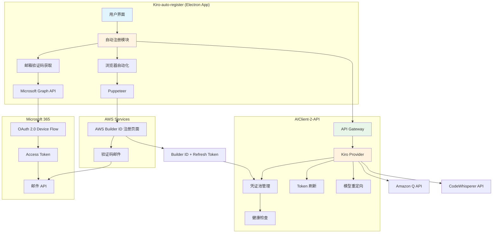
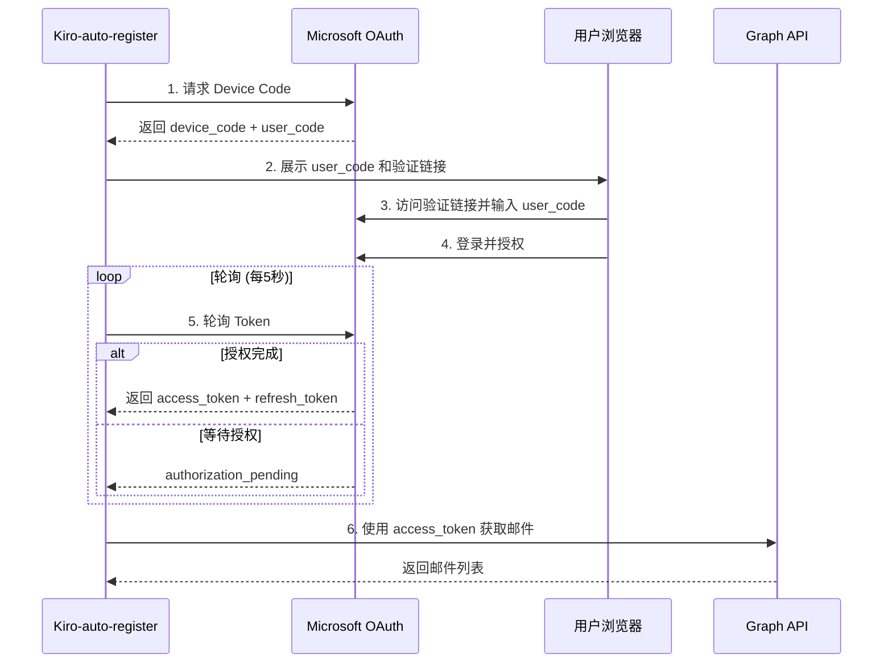
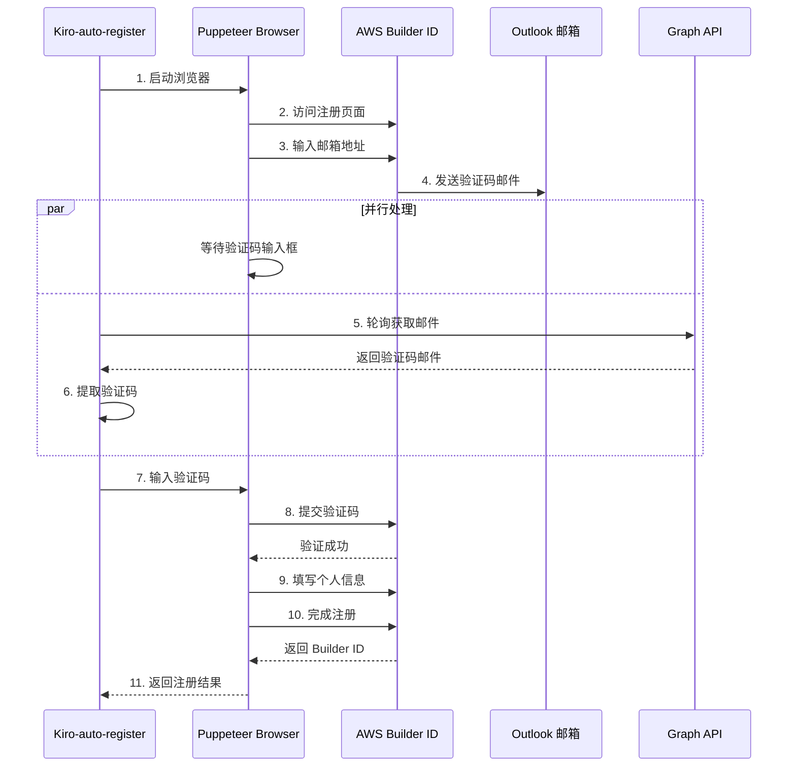
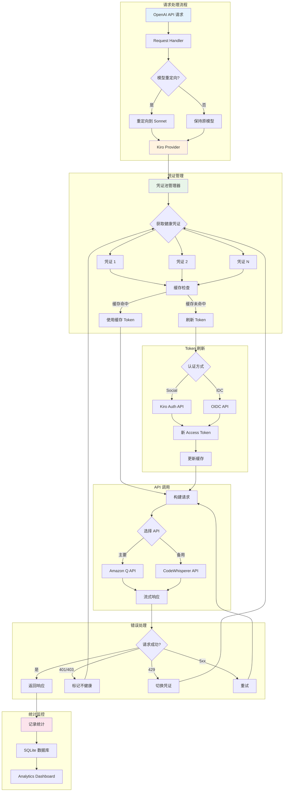
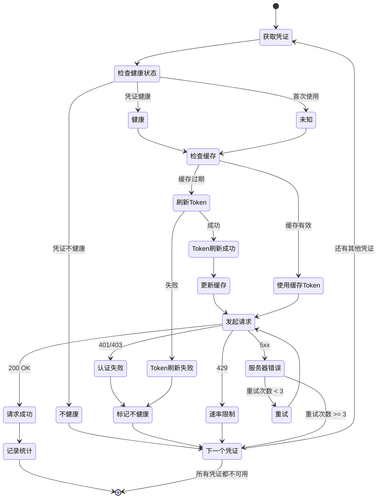
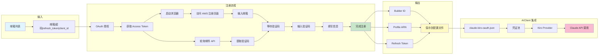

## 目录

1. [项目概述](#项目概述)

2. [Outlook OAuth2 登录验证逻辑](#outlook-oauth2-登录验证逻辑)

3. [AWS Builder ID 登录验证逻辑](#aws-builder-id-登录验证逻辑)

4. [AIClient-2-API 对 Kiro 的处理](#aiclient-2-api-对-kiro-的处理)

5. [技术要点与最佳实践](#技术要点与最佳实践)

6. [常见问题与解决方案](#常见问题与解决方案)

---

## 项目概述

本项目实现了 AWS Builder ID 的完全自动化注册流程，包括：

- Outlook 邮箱的离线验证码获取（通过 Microsoft Graph API）

- AWS Builder ID 注册流程的浏览器自动化

- 与 AIClient-2-API 的集成，实现 Claude Kiro 模型的自动化调用

**技术栈**：

- Electron + TypeScript（桌面应用）

- Puppeteer（浏览器自动化）

- Microsoft Graph API（邮箱验证码获取）

- Node.js + Express（AIClient-2-API 后端）

### 系统架构设计

#### 整体架构



#### OAuth 2.0 Device Flow 流程



#### AWS Builder ID 注册流程



#### AIClient-2-API Kiro Provider 架构



#### 凭证池轮换策略



#### 数据流图



---

## Outlook OAuth2 登录验证逻辑

### 认证流程

Outlook 使用 **OAuth 2.0 Device Authorization Grant** 流程，这是一种专为无浏览器或输入受限设备设计的授权方式。

#### 1. 获取设备码（Device Code）

**请求端点**：

```

POST https://login.microsoftonline.com/consumers/oauth2/v2.0/devicecode

```

**请求参数**：

- `client_id`: 应用程序的客户端 ID（从 Azure AD 注册获取）

- `scope`: 请求的权限范围，例如：

- `https://graph.microsoft.com/Mail.Read` - 读取邮件

- `https://graph.microsoft.com/Mail.ReadWrite` - 读写邮件

- `offline_access` - 获取刷新令牌（refresh_token）

**返回参数**：

```json
{
  "device_code": "BAQABAAEAAAAm-06blBE1TpVMil8KPQ41...",

  "user_code": "ABCD1234",

  "verification_uri": "https://microsoft.com/devicelogin",

  "expires_in": 900,

  "interval": 5,

  "message": "To sign in, use a web browser to open the page..."
}
```

**参数说明**：

- `device_code`: 设备码，用于后续轮询获取 access_token（**不展示给用户**）

- `user_code`: 用户验证码，需要用户在浏览器中输入（**展示给用户**）

- `verification_uri`: 用户需要访问的验证网址

- `expires_in`: 设备码有效期（秒），通常为 15 分钟

- `interval`: 轮询间隔（秒），建议每 5 秒轮询一次

- `message`: 提示用户的完整消息

#### 2. 用户授权

用户需要：

1. 访问 `verification_uri`（通常是 https://microsoft.com/devicelogin）

2. 输入 `user_code`（例如：ABCD1234）

3. 登录 Microsoft 账号并授权应用访问邮箱

#### 3. 轮询获取 Access Token

**请求端点**：

```

POST https://login.microsoftonline.com/consumers/oauth2/v2.0/token

```

**请求参数**：

- `grant_type`: `urn:ietf:params:oauth:grant-type:device_code`

- `client_id`: 应用程序的客户端 ID

- `device_code`: 第一步获取的设备码

**返回参数（授权成功）**：

```json
{
  "token_type": "Bearer",

  "scope": "Mail.Read offline_access",

  "expires_in": 3600,

  "access_token": "eyJ0eXAiOiJKV1QiLCJhbGc...",

  "refresh_token": "M.C509_SN1.2.U.-CqgBa..."
}
```

**参数说明**：

- `access_token`: 访问令牌，用于调用 Microsoft Graph API（**有效期 1 小时**）

- `refresh_token`: 刷新令牌，用于获取新的 access_token（**长期有效**）

- `expires_in`: access_token 有效期（秒）

- `scope`: 实际授予的权限范围

**返回参数（等待授权）**：

```json
{
  "error": "authorization_pending",

  "error_description": "User has not yet completed authorization"
}
```

**返回参数（授权超时）**：

```json
{
  "error": "expired_token",

  "error_description": "The device code has expired"
}
```

#### 4. 刷新 Access Token

当 access_token 过期后，使用 refresh_token 获取新的 access_token。

**请求端点**：

```

POST https://login.microsoftonline.com/consumers/oauth2/v2.0/token

或

POST https://login.microsoftonline.com/common/oauth2/v2.0/token

```

**请求参数**：

- `grant_type`: `refresh_token`

- `client_id`: 应用程序的客户端 ID

- `refresh_token`: 之前获取的刷新令牌

- `scope`: 请求的权限范围（可选，默认使用原有 scope）

**返回参数**：

```json
{
  "token_type": "Bearer",

  "scope": "Mail.Read offline_access",

  "expires_in": 3600,

  "access_token": "eyJ0eXAiOiJKV1QiLCJhbGc...",

  "refresh_token": "M.C509_SN1.2.U.-CqgBa..."
}
```

### 获取邮箱验证码

使用 access_token 调用 Microsoft Graph API 获取邮件内容。

**请求端点**：

```

GET https://graph.microsoft.com/v1.0/me/messages

```

**请求头**：

```

Authorization: Bearer {access_token}

```

**查询参数**：

- `$filter`: 过滤条件，例如：

- `from/emailAddress/address eq 'no-reply@signin.aws'` - 筛选发件人

- `receivedDateTime ge 2026-01-19T00:00:00Z` - 筛选时间范围

- `$orderby`: 排序方式，例如 `receivedDateTime desc` - 按接收时间倒序

- `$top`: 返回数量，例如 `10` - 返回最新 10 封邮件

- `$select`: 选择字段，例如 `subject,body,from,receivedDateTime`

**返回参数**：

```json
{
  "value": [
    {
      "id": "AAMkAGI...",

      "subject": "AWS Builder ID verification code",

      "from": {
        "emailAddress": {
          "address": "no-reply@signin.aws",

          "name": "AWS"
        }
      },

      "receivedDateTime": "2026-01-19T10:30:00Z",

      "body": {
        "contentType": "html",

        "content": "<html>Your verification code is: 123456</html>"
      }
    }
  ]
}
```

### 关键参数总结

| 参数 | 作用 | 有效期 | 存储位置 |

|------|------|--------|----------|

| `client_id` | 标识应用程序 | 永久 | 配置文件 |

| `device_code` | 用于轮询获取 token | 15 分钟 | 临时变量 |

| `user_code` | 用户输入的验证码 | 15 分钟 | 展示给用户 |

| `access_token` | 调用 Graph API | 1 小时 | 内存/临时存储 |

| `refresh_token` | 刷新 access_token | 长期有效 | 加密存储 |

### 安全注意事项

1. **refresh_token 必须加密存储**：这是长期凭证，泄露后攻击者可以持续访问邮箱

2. **不要在日志中打印完整 token**：只打印前 30 个字符用于调试

3. **使用 HTTPS**：所有 API 请求必须使用 HTTPS

4. **处理 token 过期**：实现自动刷新机制，避免用户频繁重新授权

---

## AWS Builder ID 登录验证逻辑

### 注册流程概述

AWS Builder ID 的注册流程包括以下步骤：

1. 访问注册页面并输入邮箱

2. AWS 发送验证码到邮箱

3. 输入验证码完成邮箱验证

4. 填写个人信息（姓名）

5. 完成注册并获取 Builder ID

### 关键 API 端点

#### 1. 启动注册流程

**请求端点**：

```

POST https://profile.aws.amazon.com/api/register

```

**请求参数**：

```json
{
  "email": "user@example.com",

  "locale": "en_US"
}
```

**返回参数**：

```json
{
  "sessionId": "abc123...",

  "status": "VERIFICATION_CODE_SENT"
}
```

**参数说明**：

- `sessionId`: 会话 ID，用于后续步骤

- `status`: 当前状态，`VERIFICATION_CODE_SENT` 表示验证码已发送

#### 2. 验证邮箱验证码

**请求端点**：

```

POST https://profile.aws.amazon.com/api/verify

```

**请求参数**：

```json
{
  "sessionId": "abc123...",

  "verificationCode": "123456"
}
```

**返回参数**：

```json
{
  "status": "VERIFIED",

  "token": "eyJhbGciOiJIUzI1NiIsInR5cCI6IkpXVCJ9..."
}
```

**参数说明**：

- `status`: `VERIFIED` 表示验证成功

- `token`: 临时令牌，用于完成注册

#### 3. 完成注册

**请求端点**：

```

POST https://profile.aws.amazon.com/api/complete

```

**请求参数**：

```json
{
  "token": "eyJhbGciOiJIUzI1NiIsInR5cCI6IkpXVCJ9...",

  "firstName": "John",

  "lastName": "Doe"
}
```

**返回参数**：

```json
{
  "builderId": "arn:aws:iam::123456789012:user/john.doe",

  "status": "COMPLETED"
}
```

### 浏览器自动化关键点

本项目使用 Puppeteer 进行浏览器自动化，以下是关键技术点：

#### 1. 页面元素定位

```typescript
// 等待邮箱输入框出现

await page.waitForSelector('input[type="email"]', { timeout: 30000 })

// 输入邮箱

await page.type('input[type="email"]', email)

// 点击继续按钮

await page.click('button[type="submit"]')
```

#### 2. 验证码输入

```typescript
// 等待验证码输入框

await page.waitForSelector('input[name="verificationCode"]')

// 从邮箱获取验证码

const code = await getVerificationCodeFromEmail(email)

// 输入验证码

await page.type('input[name="verificationCode"]', code)
```

#### 3. 处理页面跳转和加载

```typescript
// 等待导航完成

await Promise.all([
  page.waitForNavigation({ waitUntil: "networkidle2" }),

  page.click('button[type="submit"]'),
])

// 等待特定元素出现，确认页面加载完成

await page.waitForSelector(".success-message", { timeout: 10000 })
```

#### 4. 错误处理

```typescript
try {
  await page.waitForSelector(".error-message", { timeout: 2000 })

  const errorText = await page.$eval(".error-message", (el) => el.textContent)

  throw new Error(`注册失败: ${errorText}`)
} catch (error) {
  if (error.name === "TimeoutError") {
    // 没有错误消息，继续执行
  } else {
    throw error
  }
}
```

### 验证码获取策略

本项目实现了多种验证码获取策略，按优先级排序：

#### 1. 离线获取（Microsoft Graph API）

**优点**：

- 无需浏览器，速度快

- 可以批量处理

- 不受邮箱登录限制

**实现**：

```typescript
async function getCodeOffline(
  email: string,
  refreshToken: string,
  clientId: string,
): Promise<string> {
  // 1. 刷新 access_token

  const accessToken = await refreshAccessToken(refreshToken, clientId)

  // 2. 获取最新邮件

  const messages = await fetchRecentMessages(accessToken, "no-reply@signin.aws")

  // 3. 提取验证码

  for (const message of messages) {
    const code = extractVerificationCode(message.body.content)

    if (code) return code
  }

  throw new Error("未找到验证码")
}
```

#### 2. 在线获取（Puppeteer 登录邮箱）

**优点**：

- 不需要 refresh_token

- 适用于首次使用

**缺点**：

- 需要浏览器，速度慢

- 可能触发人机验证

### 验证码提取正则表达式

```typescript
const CODE_PATTERNS = [
  /verification code is[：:\s]*(\d{6})/gi,

  /(?:verification\s*code|验证码|Your code is|code is)[：:\s]*(\d{6})/gi,

  /(?:is|为)[：:\s]*(\d{6})\b/gi,

  /^\s*(\d{6})\s*$/gm, // 单独一行的6位数字

  />\s*(\d{6})\s*</g, // HTML标签之间的6位数字
]

function extractVerificationCode(html: string): string | null {
  const text = htmlToText(html)

  for (const pattern of CODE_PATTERNS) {
    const matches = text.matchAll(pattern)

    for (const match of matches) {
      const code = match[1]

      if (/^\d{6}$/.test(code)) {
        return code
      }
    }
  }

  return null
}
```

### AWS 验证码发件人列表

```typescript
const AWS_SENDERS = [
  "no-reply@signin.aws", // AWS 新发件人（2024年后）

  "no-reply@login.awsapps.com",

  "noreply@amazon.com",

  "account-update@amazon.com",

  "no-reply@aws.amazon.com",

  "noreply@aws.amazon.com",

  "aws", // 模糊匹配
]
```

### 关键参数总结

| 参数 | 作用 | 来源 | 存储位置 |

|------|------|------|----------|

| `email` | 注册邮箱 | 用户输入 | 配置文件 |

| `sessionId` | 会话标识 | AWS API 返回 | 临时变量 |

| `verificationCode` | 邮箱验证码 | 邮件内容 | 临时变量 |

| `token` | 临时令牌 | 验证成功后返回 | 临时变量 |

| `builderId` | AWS Builder ID | 注册完成后返回 | 数据库/文件 |

### 注意事项

1. **验证码时效性**：AWS 验证码通常 10 分钟内有效，需要快速获取和输入

2. **邮件延迟**：AWS 发送邮件可能有 5-30 秒延迟，需要实现重试机制

3. **人机验证**：频繁注册可能触发 CAPTCHA，需要降低频率或使用代理

4. **邮箱限制**：同一邮箱不能重复注册，需要使用不同邮箱

5. **浏览器指纹**：使用 Puppeteer 时需要模拟真实浏览器行为，避免被检测

---

## AIClient-2-API 对 Kiro 的处理

### Kiro 提供商架构

AIClient-2-API 实现了一个完整的 Kiro（AWS Builder ID）提供商，用于调用 Claude 模型。

#### 核心组件

1. **claude-kiro.js** - Kiro 提供商主文件

2. **kiro-token-refresh.js** - Token 刷新脚本

3. **kiro-idc-token-refresh.js** - IDC Token 刷新脚本

4. **auto-reset-kiro-health.js** - 自动健康检查和重置

### 关键 API 端点

#### 1. Token 刷新端点

**Social 认证方式**（Builder ID）：

```

POST https://prod.{region}.auth.desktop.kiro.dev/refreshToken

```

**IDC 认证方式**（企业账号）：

```

POST https://oidc.{region}.amazonaws.com/token

```

**请求参数**：

```json
{
  "refreshToken": "eyJhbGciOiJIUzI1NiIsInR5cCI6IkpXVCJ9...",

  "region": "us-east-1"
}
```

**返回参数**：

```json
{
  "accessToken": "eyJhbGciOiJIUzI1NiIsInR5cCI6IkpXVCJ9...",

  "expiresIn": 3600
}
```

#### 2. 生成响应端点

**Amazon Q API**：

```

POST https://q.{region}.amazonaws.com/generateAssistantResponse

```

**CodeWhisperer API**（备用）：

```

POST https://codewhisperer.{region}.amazonaws.com/SendMessageStreaming

```

**请求头**：

```

Authorization: Bearer {accessToken}

User-Agent: KiroIDE

x-amz-kiro-version: 0.7.5

Content-Type: application/json

```

**请求参数**：

```json
{
  "conversationState": {
    "conversationId": "uuid-v4",

    "history": [],

    "currentMessage": {
      "userInputMessage": {
        "content": "Hello, Claude!"
      }
    },

    "chatTriggerType": "MANUAL"
  },

  "profileArn": "arn:aws:iam::123456789012:user/john.doe",

  "modelName": "CLAUDE_SONNET_4_5_20250929_V1_0"
}
```

### 模型映射

Kiro 使用特殊的模型名称格式，需要进行映射：

```javascript
const MODEL_MAPPING = {
  "claude-opus-4-5": "claude-opus-4.5",

  "claude-opus-4-5-20251101": "claude-opus-4.5",

  "claude-haiku-4-5": "claude-haiku-4.5",

  "claude-sonnet-4-5": "CLAUDE_SONNET_4_5_20250929_V1_0",

  "claude-sonnet-4-5-20250929": "CLAUDE_SONNET_4_5_20250929_V1_0",

  "claude-sonnet-4-20250514": "CLAUDE_SONNET_4_20250514_V1_0",

  "claude-3-7-sonnet-20250219": "CLAUDE_3_7_SONNET_20250219_V1_0",
}
```

**注意**：

- Opus 和 Haiku 模型使用 `claude-opus-4.5` 格式

- Sonnet 模型使用 `CLAUDE_SONNET_4_5_20250929_V1_0` 格式

### 模型重定向功能

AIClient-2-API 实现了模型重定向功能，可以将 Opus 和 Haiku 请求自动重定向到 Sonnet：

```javascript

// 在 configs/plugins.json 中配置

{

"kiro-model-redirect": {

"enabled": true,

"config": {

"redirectRules": {

"claude-opus-4-5": "claude-sonnet-4-5",

"claude-haiku-4-5": "claude-sonnet-4-5"

}

}

}

}

```

**重定向逻辑**：

1. 用户请求 `claude-opus-4-5`

2. 插件拦截请求，重定向到 `claude-sonnet-4-5`

3. 统计数据库记录原始模型和重定向后的模型

4. 返回响应时保持原始模型名称

### 凭证管理

#### 1. 凭证池（Credential Pool）

AIClient-2-API 使用凭证池管理多个 Kiro 账号：

```javascript

// configs/claude-kiro-oauth.json

{

"credentials": [

{

"uuid": "account-1",

"profileArn": "arn:aws:iam::123456789012:user/john.doe",

"refreshToken": "eyJhbGciOiJIUzI1NiIsInR5cCI6IkpXVCJ9...",

"region": "us-east-1",

"authMethod": "social"

},

{

"uuid": "account-2",

"profileArn": "arn:aws:iam::123456789012:user/jane.smith",

"refreshToken": "eyJhbGciOiJIUzI1NiIsInR5cCI6IkpXVCJ9...",

"region": "us-east-1",

"authMethod": "social"

}

]

}

```

#### 2. 凭证轮换策略

**轮询策略**（默认）：

- 按顺序使用每个凭证

- 失败后自动切换到下一个

- 所有凭证失败后返回错误

**健康检查**：

- 定期检查凭证是否可用

- 标记不健康的凭证

- 自动跳过不健康的凭证

#### 3. 凭证缓存

使用 `CredentialCacheManager` 缓存 access_token：

```javascript
class CredentialCacheManager {
  constructor() {
    this.cache = new Map()
  }

  set(key, accessToken, expiresIn) {
    const expiresAt = Date.now() + (expiresIn - 60) * 1000 // 提前60秒过期

    this.cache.set(key, { accessToken, expiresAt })
  }

  get(key) {
    const cached = this.cache.get(key)

    if (!cached) return null

    if (Date.now() >= cached.expiresAt) {
      this.cache.delete(key)

      return null
    }

    return cached.accessToken
  }
}
```

### 错误处理

#### 1. 凭证错误

```javascript
class CredentialError extends Error {
  constructor(message, options = {}) {
    super(message)

    this.name = "CredentialError"

    this.shouldSwitchCredential = options.shouldSwitchCredential ?? false

    this.skipErrorCount = options.skipErrorCount ?? false

    this.credentialMarkedUnhealthy = options.credentialMarkedUnhealthy ?? false

    this.statusCode = options.statusCode
  }
}
```

**错误类型**：

- `401 Unauthorized`: Token 过期或无效，需要刷新

- `403 Forbidden`: 权限不足，标记凭证为不健康

- `429 Too Many Requests`: 速率限制，切换到下一个凭证

- `500 Internal Server Error`: 服务器错误，重试

#### 2. 重试机制

```javascript
async function retryWithExponentialBackoff(fn, maxRetries = 3) {
  for (let i = 0; i < maxRetries; i++) {
    try {
      return await fn()
    } catch (error) {
      if (i === maxRetries - 1) throw error

      if (!isRetryableNetworkError(error)) throw error

      const delay = Math.min(1000 * Math.pow(2, i), 10000)

      await new Promise((resolve) => setTimeout(resolve, delay))
    }
  }
}
```

### 统计与监控

#### 1. 请求统计

AIClient-2-API 记录每个请求的详细信息：

```javascript

{

"requestId": "uuid-v4",

"timestamp": "2026-01-19T10:30:00Z",

"provider": "claude-kiro-oauth",

"model": "claude-sonnet-4-5",

"originalModel": "claude-opus-4-5", // 如果有重定向

"credentialUuid": "account-1",

"inputTokens": 1000,

"outputTokens": 500,

"totalTokens": 1500,

"duration": 5000, // 毫秒

"status": "success",

"error": null

}

```

#### 2. 健康检查

定期检查凭证健康状态：

```javascript
async function checkCredentialHealth(credential) {
  try {
    const accessToken = await refreshToken(credential)

    const response = await testRequest(accessToken)

    return response.ok
  } catch (error) {
    return false
  }
}
```

### 关键参数总结

| 参数 | 作用 | 来源 | 存储位置 |

|------|------|------|----------|

| `profileArn` | AWS 用户标识 | Builder ID 注册 | 配置文件 |

| `refreshToken` | 刷新令牌 | Builder ID 登录 | 加密配置文件 |

| `accessToken` | 访问令牌 | Token 刷新 | 内存缓存 |

| `region` | AWS 区域 | 配置 | 配置文件 |

| `authMethod` | 认证方式 | 配置 | 配置文件 |

| `uuid` | 凭证唯一标识 | 自动生成 | 配置文件 |

### 最佳实践

1. **使用凭证池**：配置多个账号，提高可用性和速率限制

2. **启用缓存**：缓存 access_token，减少刷新请求

3. **健康检查**：定期检查凭证状态，及时发现问题

4. **错误处理**：实现完善的错误处理和重试机制

5. **监控统计**：记录请求详情，便于分析和优化

6. **模型重定向**：合理使用重定向功能，节省成本

---

## 技术要点与最佳实践

### 1. OAuth 2.0 Device Flow 实现

**核心要点**：

- Device Flow 适用于无浏览器或输入受限的设备

- 需要实现轮询机制，建议间隔 5 秒

- 必须处理 `authorization_pending`、`expired_token` 等错误

- refresh_token 是长期凭证，必须加密存储

**最佳实践**：

```typescript
// 实现指数退避的轮询机制

async function pollForToken(deviceCode: string, interval: number = 5): Promise<TokenResponse> {
  const maxAttempts = 180 // 15分钟超时

  let attempts = 0

  while (attempts < maxAttempts) {
    await new Promise((resolve) => setTimeout(resolve, interval * 1000))

    try {
      const response = await requestToken(deviceCode)

      return response
    } catch (error) {
      if (error.error === "authorization_pending") {
        attempts++

        continue
      } else if (error.error === "slow_down") {
        interval += 5 // 增加轮询间隔

        attempts++

        continue
      } else {
        throw error
      }
    }
  }

  throw new Error("授权超时")
}
```

### 2. Microsoft Graph API 邮件获取

**核心要点**：

- 使用 OData 查询语法进行精确过滤

- 注意时区问题，使用 UTC 时间

- HTML 邮件需要转换为纯文本再提取验证码

- 实现多种正则表达式模式，提高匹配成功率

**最佳实践**：

```typescript
// 构建精确的过滤条件

const filter = [
  `from/emailAddress/address eq 'no-reply@signin.aws'`,

  `receivedDateTime ge ${new Date(Date.now() - 5 * 60 * 1000).toISOString()}`, // 最近5分钟

  `subject contains 'verification'`,
].join(" and ")

const url =
  `https://graph.microsoft.com/v1.0/me/messages?` +
  `$filter=${encodeURIComponent(filter)}&` +
  `$orderby=receivedDateTime desc&` +
  `$top=10&` +
  `$select=subject,body,from,receivedDateTime`
```

### 3. Puppeteer 浏览器自动化

**核心要点**：

- 使用 `waitForSelector` 确保元素加载完成

- 使用 `Promise.all` 处理导航和点击的竞态条件

- 实现超时和重试机制

- 模拟真实用户行为，避免被检测

**最佳实践**：

```typescript
// 启动浏览器时的配置

const browser = await puppeteer.launch({
  headless: false, // 开发时使用 false，生产使用 true

  args: [
    "--no-sandbox",

    "--disable-setuid-sandbox",

    "--disable-blink-features=AutomationControlled", // 隐藏自动化特征

    "--user-agent=Mozilla/5.0 (Macintosh; Intel Mac OS X 10_15_7)...",
  ],
})

// 设置真实的 viewport

await page.setViewport({ width: 1920, height: 1080 })

// 注入脚本隐藏 webdriver 特征

await page.evaluateOnNewDocument(() => {
  Object.defineProperty(navigator, "webdriver", { get: () => false })
})

// 模拟人类输入速度

await page.type('input[type="email"]', email, { delay: 100 })
```

### 4. 验证码提取策略

**核心要点**：

- 实现多种正则表达式模式，覆盖不同邮件格式

- HTML 转文本时保留换行符，便于匹配单独一行的验证码

- 验证提取结果，确保是 6 位数字

- 处理多个匹配结果，选择最可能的验证码

**最佳实践**：

```typescript
function extractVerificationCode(html: string): string | null {
  // 1. HTML 转文本

  const text = htmlToText(html)

  // 2. 按优先级尝试多种模式

  const patterns = [
    /verification code is[：:\s]*(\d{6})/gi, // 明确的验证码标识

    /(?:code|验证码)[：:\s]*(\d{6})/gi, // 通用模式

    /^\s*(\d{6})\s*$/gm, // 单独一行

    />\s*(\d{6})\s*</g, // HTML 标签之间
  ]

  const candidates = []

  for (const pattern of patterns) {
    const matches = text.matchAll(pattern)

    for (const match of matches) {
      const code = match[1]

      if (/^\d{6}$/.test(code)) {
        candidates.push({ code, priority: patterns.indexOf(pattern) })
      }
    }
  }

  // 3. 返回优先级最高的验证码

  if (candidates.length === 0) return null

  candidates.sort((a, b) => a.priority - b.priority)

  return candidates[0].code
}
```

### 5. 凭证池管理

**核心要点**：

- 使用 UUID 唯一标识每个凭证

- 实现健康检查机制，自动跳过不健康的凭证

- 缓存 access_token，减少刷新请求

- 实现凭证轮换策略，均衡负载

**最佳实践**：

```typescript
class CredentialPoolManager {
  constructor(credentials) {
    this.credentials = credentials

    this.currentIndex = 0

    this.healthStatus = new Map()

    this.cache = new CredentialCacheManager()
  }

  async getNextHealthyCredential() {
    const startIndex = this.currentIndex

    do {
      const credential = this.credentials[this.currentIndex]

      this.currentIndex = (this.currentIndex + 1) % this.credentials.length

      // 检查健康状态

      if (this.healthStatus.get(credential.uuid) === false) {
        continue
      }

      return credential
    } while (this.currentIndex !== startIndex)

    throw new Error("没有可用的健康凭证")
  }

  markUnhealthy(uuid) {
    this.healthStatus.set(uuid, false)

    console.log(`凭证 ${uuid} 已标记为不健康`)
  }

  async refreshHealthStatus() {
    for (const credential of this.credentials) {
      const isHealthy = await this.checkHealth(credential)

      this.healthStatus.set(credential.uuid, isHealthy)
    }
  }
}
```

### 6. 错误处理与重试

**核心要点**：

- 区分可重试错误和不可重试错误

- 实现指数退避算法

- 设置合理的超时时间

- 记录详细的错误日志

**最佳实践**：

```typescript
// 可重试的错误类型

const RETRYABLE_ERRORS = ["ECONNRESET", "ETIMEDOUT", "ENOTFOUND", "ECONNREFUSED"]

const RETRYABLE_STATUS_CODES = [408, 429, 500, 502, 503, 504]

function isRetryableError(error) {
  // 网络错误

  if (RETRYABLE_ERRORS.includes(error.code)) return true

  // HTTP 状态码

  if (error.response && RETRYABLE_STATUS_CODES.includes(error.response.status)) {
    return true
  }

  return false
}

async function retryWithBackoff(fn, options = {}) {
  const {
    maxRetries = 3,

    initialDelay = 1000,

    maxDelay = 10000,

    factor = 2,
  } = options

  for (let attempt = 0; attempt < maxRetries; attempt++) {
    try {
      return await fn()
    } catch (error) {
      const isLastAttempt = attempt === maxRetries - 1

      if (isLastAttempt || !isRetryableError(error)) {
        throw error
      }

      const delay = Math.min(initialDelay * Math.pow(factor, attempt), maxDelay)

      console.log(`重试 ${attempt + 1}/${maxRetries}，等待 ${delay}ms...`)

      await new Promise((resolve) => setTimeout(resolve, delay))
    }
  }
}
```

### 7. 安全性考虑

**核心要点**：

- 敏感数据（token、密码）必须加密存储

- 不要在日志中打印完整的敏感信息

- 使用环境变量或配置文件管理敏感配置

- 实现访问控制，限制 API 访问

**最佳实践**：

```typescript
// 加密存储 refresh_token

import crypto from "crypto"

const ENCRYPTION_KEY = process.env.ENCRYPTION_KEY || "default-key-change-me"

function encrypt(text: string): string {
  const cipher = crypto.createCipher("aes-256-cbc", ENCRYPTION_KEY)

  let encrypted = cipher.update(text, "utf8", "hex")

  encrypted += cipher.final("hex")

  return encrypted
}

function decrypt(encrypted: string): string {
  const decipher = crypto.createDecipher("aes-256-cbc", ENCRYPTION_KEY)

  let decrypted = decipher.update(encrypted, "hex", "utf8")

  decrypted += decipher.final("utf8")

  return decrypted
}

// 日志脱敏

function maskToken(token: string): string {
  if (!token || token.length < 10) return "***"

  return token.substring(0, 10) + "..." + token.substring(token.length - 10)
}

console.log(`Token: ${maskToken(refreshToken)}`)
```

### 8. 性能优化

**核心要点**：

- 使用缓存减少 API 请求

- 并行处理多个任务

- 实现连接池复用

- 监控性能指标

**最佳实践**：

```typescript
// 使用 axios 连接池

const axiosInstance = axios.create({
  timeout: 30000,

  httpAgent: new http.Agent({ keepAlive: true, maxSockets: 50 }),

  httpsAgent: new https.Agent({ keepAlive: true, maxSockets: 50 }),
})

// 并行处理多个注册任务

async function batchRegister(emails: string[]) {
  const batchSize = 5 // 每批处理 5 个

  const results = []

  for (let i = 0; i < emails.length; i += batchSize) {
    const batch = emails.slice(i, i + batchSize)

    const batchResults = await Promise.allSettled(batch.map((email) => registerAccount(email)))

    results.push(...batchResults)

    // 批次之间延迟，避免触发速率限制

    if (i + batchSize < emails.length) {
      await new Promise((resolve) => setTimeout(resolve, 5000))
    }
  }

  return results
}
```

---

## 常见问题与解决方案

### 1. Microsoft Graph API 相关

#### Q: refresh_token 过期怎么办？

**A**: refresh_token 通常长期有效（90天或更长），但可能因以下原因失效：

- 用户修改了密码

- 用户撤销了应用授权

- 长时间未使用（超过90天）

**解决方案**：

- 实现 refresh_token 过期检测

- 提示用户重新授权

- 定期使用 refresh_token 保持活跃

```typescript
async function ensureValidToken(credential) {
  try {
    const accessToken = await refreshAccessToken(credential.refreshToken)

    return accessToken
  } catch (error) {
    if (error.error === "invalid_grant") {
      console.error("refresh_token 已过期，需要重新授权")

      // 触发重新授权流程

      await reauthorize(credential)
    }

    throw error
  }
}
```

#### Q: 获取不到验证码邮件？

**A**: 可能的原因：

- 邮件延迟（AWS 发送邮件可能需要 5-30 秒）

- 邮件被过滤到垃圾箱

- 发件人地址变更（AWS 更新了发件人）

**解决方案**：

- 实现重试机制，最多等待 60 秒

- 扩大搜索范围，检查所有文件夹

- 更新发件人列表

```typescript
async function waitForVerificationEmail(accessToken, maxWaitTime = 60000) {
  const startTime = Date.now()

  const checkInterval = 5000 // 每5秒检查一次

  while (Date.now() - startTime < maxWaitTime) {
    const messages = await fetchRecentMessages(accessToken)

    for (const message of messages) {
      const code = extractVerificationCode(message.body.content)

      if (code) return code
    }

    await new Promise((resolve) => setTimeout(resolve, checkInterval))
  }

  throw new Error("等待验证码超时")
}
```

### 2. AWS Builder ID 注册相关

#### Q: 注册时遇到 CAPTCHA 怎么办？

**A**: 频繁注册可能触发人机验证。

**解决方案**：

- 降低注册频率（每个账号间隔 30-60 秒）

- 使用不同的 IP 地址（代理）

- 模拟真实用户行为（随机延迟、鼠标移动）

- 使用 CAPTCHA 识别服务（2captcha、Anti-Captcha）

```typescript
// 模拟真实用户行为

async function humanLikeDelay(min = 1000, max = 3000) {
  const delay = Math.random() * (max - min) + min

  await new Promise((resolve) => setTimeout(resolve, delay))
}

await page.type('input[type="email"]', email, { delay: 100 })

await humanLikeDelay()

await page.click('button[type="submit"]')
```

#### Q: 同一邮箱不能重复注册？

**A**: AWS Builder ID 要求每个邮箱只能注册一次。

**解决方案**：

- 使用邮箱别名（Gmail: user+1@gmail.com, user+2@gmail.com）

- 使用临时邮箱服务

- 批量购买邮箱账号

### 3. Kiro API 调用相关

#### Q: Token 刷新失败，返回 401？

**A**: 可能的原因：

- refresh_token 已过期

- 认证方式不正确（social vs idc）

- 区域配置错误

**解决方案**：

```typescript
async function refreshTokenWithFallback(credential) {
  const endpoints = [
    `https://prod.${credential.region}.auth.desktop.kiro.dev/refreshToken`,

    `https://oidc.${credential.region}.amazonaws.com/token`,
  ]

  for (const endpoint of endpoints) {
    try {
      const response = await axios.post(endpoint, {
        refreshToken: credential.refreshToken,
      })

      return response.data.accessToken
    } catch (error) {
      console.log(`端点 ${endpoint} 失败，尝试下一个...`)
    }
  }

  throw new Error("所有刷新端点都失败")
}
```

#### Q: 模型请求返回 403 Forbidden？

**A**: 可能的原因：

- 账号没有权限访问该模型

- 账号被限制或封禁

- profileArn 不正确

**解决方案**：

- 检查账号权限

- 切换到其他凭证

- 使用支持的模型（Sonnet 4.5）

#### Q: 请求速率限制（429 Too Many Requests）？

**A**: AWS 对每个账号有速率限制。

**解决方案**：

- 使用凭证池，轮换多个账号

- 实现请求队列，控制并发数

- 遇到 429 时自动切换凭证

```typescript
class RateLimiter {
  constructor(maxConcurrent = 5) {
    this.maxConcurrent = maxConcurrent

    this.currentConcurrent = 0

    this.queue = []
  }

  async execute(fn) {
    while (this.currentConcurrent >= this.maxConcurrent) {
      await new Promise((resolve) => this.queue.push(resolve))
    }

    this.currentConcurrent++

    try {
      return await fn()
    } finally {
      this.currentConcurrent--

      const resolve = this.queue.shift()

      if (resolve) resolve()
    }
  }
}
```

### 4. Puppeteer 相关

#### Q: 浏览器启动失败？

**A**: 可能缺少系统依赖。

**解决方案**：

```bash

# Ubuntu/Debian

sudo apt-get install -y \

chromium-browser \

libx11-xcb1 \

libxcomposite1 \

libxcursor1 \

libxdamage1 \

libxi6 \

libxtst6 \

libnss3 \

libcups2 \

libxss1 \

libxrandr2 \

libasound2 \

libpangocairo-1.0-0 \

libatk1.0-0 \

libatk-bridge2.0-0 \

libgtk-3-0

# macOS

brew install chromium

```

#### Q: 页面元素找不到？

**A**: 可能的原因：

- 页面加载未完成

- 元素选择器不正确

- 页面结构变更

**解决方案**：

```typescript
// 使用更灵活的等待策略

async function waitForElement(page, selector, options = {}) {
  const { timeout = 30000, visible = true } = options

  try {
    await page.waitForSelector(selector, { timeout, visible })

    return true
  } catch (error) {
    // 尝试备用选择器

    const alternativeSelectors = [
      selector.replace('input[type="email"]', 'input[name="email"]'),

      selector.replace('button[type="submit"]', "button.submit-btn"),
    ]

    for (const altSelector of alternativeSelectors) {
      try {
        await page.waitForSelector(altSelector, { timeout: 5000, visible })

        return true
      } catch {}
    }

    throw new Error(`元素未找到: ${selector}`)
  }
}
```

### 5. 性能与稳定性

#### Q: 批量注册时内存占用过高？

**A**: Puppeteer 浏览器实例占用大量内存。

**解决方案**：

- 限制并发浏览器数量

- 及时关闭浏览器实例

- 使用浏览器池复用实例

```typescript
class BrowserPool {
  constructor(maxSize = 3) {
    this.maxSize = maxSize

    this.pool = []
  }

  async acquire() {
    if (this.pool.length > 0) {
      return this.pool.pop()
    }

    if (this.pool.length < this.maxSize) {
      return await puppeteer.launch()
    }

    // 等待可用实例

    await new Promise((resolve) => setTimeout(resolve, 1000))

    return this.acquire()
  }

  release(browser) {
    if (this.pool.length < this.maxSize) {
      this.pool.push(browser)
    } else {
      browser.close()
    }
  }
}
```

#### Q: 如何监控系统运行状态？

**A**: 实现完善的监控和日志系统。

**解决方案**：

```typescript
// 使用 Winston 记录结构化日志

import winston from "winston"

const logger = winston.createLogger({
  level: "info",

  format: winston.format.json(),

  transports: [
    new winston.transports.File({ filename: "error.log", level: "error" }),

    new winston.transports.File({ filename: "combined.log" }),
  ],
})

// 记录关键指标

logger.info("注册完成", {
  email: maskEmail(email),

  duration: Date.now() - startTime,

  success: true,
})

// 使用 Prometheus 导出指标

const promClient = require("prom-client")

const register = new promClient.Registry()

const registerCounter = new promClient.Counter({
  name: "aws_builder_id_registrations_total",

  help: "Total number of AWS Builder ID registrations",

  labelNames: ["status"],
})

register.registerMetric(registerCounter)
```

---

## 总结

本项目实现了 AWS Builder ID 的完全自动化注册流程，涉及多个技术栈和复杂的集成。关键技术点包括：

1. **OAuth 2.0 Device Flow**：实现无浏览器的邮箱授权

2. **Microsoft Graph API**：离线获取邮箱验证码

3. **Puppeteer 自动化**：模拟真实用户注册流程

4. **凭证池管理**：实现高可用的多账号轮换

5. **错误处理与重试**：确保系统稳定性

6. **安全性考虑**：保护敏感数据

通过合理的架构设计和最佳实践，可以构建一个稳定、高效、安全的自动化系统。

---

**项目地址**：

- Kiro-auto-register: `/Users/pejoyll/Desktop/code/2026/Kiro-auto-register`

- AIClient-2-API: `/Users/pejoyll/Desktop/code/2026/AIClient-2-API`

**版本信息**：

- Kiro-auto-register: v1.0.0

- AIClient-2-API: v2.7.7.3-kiro

**最后更新**：2026-01-19
